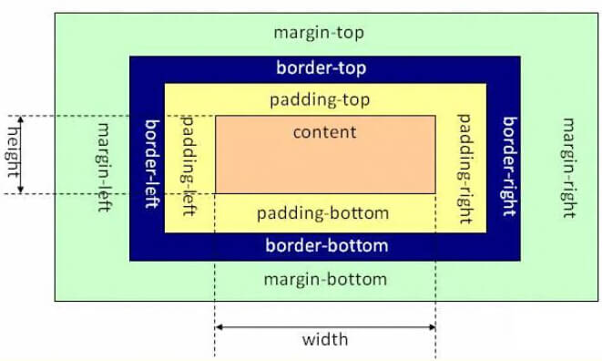

title: 说说基本的布局观         
date: 2015-12-01
tags: [CSS]
categories: [CSS]
toc: true
---

这个话题由我来说可能不是最合适的，论资历和认识，我不如那些征战多年的行业前辈们，但是我想做的事情，请别人花时间和精力来做，觉得不大合适，我也愿意写这么一篇文来分享一些关于网页布局最基本的东西。这篇文会有两个特点：

一、不会有“深刻认识”、“揭秘”之类的出现，因为本来就没有；不会有很厉害或者通用的布局方案告诉大家，不是本文重点；也不会时不时把标准搬出来，只会直观的简要描述。

二、会带有一定的故事情节，我相信前端们都有着相似的经历，沿着故事的发展路线，或许你会产生更多的共鸣。

换句简单的话说就是：更适合初学者看~

好了，言归正传。

## 话题的来由

我个人有个QQ群，为了保持一个比较好的交流环境，不让更多不相关的人进来，设置了一个问题：“回答至少两种布局方法”。这个问题虽不算十分具体，但也不笼统，靠边或者正确的答案大概有这几种：“div、table、css、流式布局、浮动、定位”。 那么问题来了，哪些是靠边，这得看对“方法”二字的理解。

先来看几段故事吧。

故事一：**大学课堂**

老师对我们说：“表格，是一种很常见，很流行的布局方式，它的特点是能够很容易的把网页排版的整齐好看，另外，给你们推荐一款容易上手又好用的代码编辑器，dreamweaver8.”

故事二：**小试牛刀**

要毕业设计了，对网页制作很感兴趣，于是就选了一个看起来像是做网站的课题，拿到之后，凭着已经了解的一丁点的知识，开始构思，动手，一切貌似顺风顺水，当做到导航栏的时候，采用了ul（无序列表）的方式，但是遇到了第一个算得上“难题”的东西，列表是竖着排列的，我要的是横着的，这可怎么办，我就去群里问，没人回答，于是乎，想到了度娘，强大的网友一下就给出了答案——float，觉得自己知道了个秘密，这时候我一个经常请教的前辈告诉我，谁跟你说排成一行就要用float，span也行啊！我有点不忿，更不解，span是什么？

故事三：**div+css**

你可以到任意一家电商网站，搜索“div”，肯定能搜到“div+css网页布局**”之类的书，div是什么，有什么用？这是我早期曾在一些技术群里问过的问题，得到的答案已经记不清了，应该是没能解答我的疑惑，为什么没有呢？下面详述。

故事四：**初入职场**

初入社会，好不容易有个面试的机会，是在线的形式，面试官问了我几个问题，其中一个是，怎样让元素居中？我犹豫了一会儿，回他：align=“center；”然后他说，算有点基础，不过需要培训一下。

故事五：**一次专访**

有一次面试，面试官问我，怎样看待网页重构。我的答案就不说了，后来有一次自主联系访谈本公司职员的机会，我怎会轻易放过~于是我约了他，准备了一堆的问题，也把这个问题问了回去。他的答案提取出一部分就是：html之于网页，就像是身体躯干之于人，起到一个整体结构和骨架的作用，css之于网页，像是人的衣着打扮。

以上几段，都是真实经历的浓缩。下面会有对应诠释。

故事告诉我们

对应以上几个故事，有这几方面

**第一个故事**

很直观的有两点表现，网页结构主要用table，编程工具使用dreamweaver。这种现象可能你并不陌生，这表明什么呢？

前端技术（书籍）的引进和推广有所延迟

前端，甚至是网站建设的学校教育重视程度不够

从事相关教育的从业者有部分不在一线，专业度较低、知识更新速度较慢

很多人最开始写网页代码用的是dreamweaver **，采用table为网页结构的主力军，预览效果和调试是用360浏览器（直接在DW里看的就不说了），这些都是存在的对吧？也不能说它不对或者不好，有一定的历史原因在里面，css诞生，web标准的诞生和引进以及chrome、firefox这些浏览器的出现和推广使用，都是影响因素。不能去评判它的对与错，但他们给初学者对于书写代码的习惯、方法，工具的选择等造成的不利影响是客观事实。

不过庆幸的是，前端职位在近几年移动互联网浪潮之下的持续火爆，更多的人进入了前端行列，更多的教育组织、机构的出现，更多学习资源，更多f2er的努力，一切都在变得更好。

**第二个故事**

我们学习一项技术，总会有马上就动手试试的冲动，一个简单的东西，都会产生一种成就感，特别是像网页这种，可视化很强，于此同时就会有个问题，我们最初了解到的知识都是片面的，就很容易遇到各种大大小小的问题，然后会急于找到解决方案，寻求这个方案的过程呢，既不会考虑全面性，也不会深挖，也没有能力衡量优劣，甚至会把遇到的一个看起来可行的方案当做唯一正确的方案。我当时的疑问点恰在于此，纯粹是因为基础薄弱，最基本的“块元素”和“行内元素”都没了解清楚，所以，很多基础的，简单的东西，都是可以通过自己踏实、系统的学习去解开。

**第三个故事**

div+css，广为诟病的一种说法，很多书籍以它命名，很多招聘信息也是这么写的，我们知道可能是偷懒或者其他原因，至少作为当时的我对它的印象是：div也是一门技术，具有很多的知识点，或者具备某些功能，因为它俩是并列关系呀。读这篇文时你应该知道了，这种认识有点可笑。 这是在推广使用css技术，推广“结构和表现分离”思想之后一段时间内所兴起的浪潮，影响至今，虽然很多人不会再有像我当时那样的误解，但在鼓励使用语义化标签和推广HTML5新标准的今天，仍然有不少人在滥用着div标签。

**第四个故事**

当时的我，是已经完成了毕业设计，自认为至少具备了基本的网页制作能力。可是对居中的认知还停留在align=“center”这种写法，不知道分离，更是对现在一些丰富的居中方法一无所知。真的是纯正的菜鸟，这应该是多数前端人会走的过程吧。

**第五个故事**

算是对“结构表现分离”思想的一种解释。其实这里不是在弱化结构强调表现，真正写得好的结构，是不需要写什么样式也不会让读者觉得别扭的，就像是一种说法：看一个人html写得好还是不好，直接把样式去掉看就知道了~当然，也涉及到语义化的运用，格式和注释等，这里不详说。

以上的故事，以及它们所表达的东西，就是一个对网页制作认知的进化过程，也为了不那么突兀的就直接进入下面的内容。

## 那什么是布局

不管是初学者还是老手，都知道网页是由大大小小的容器组成，或者称之为元素，这里有个点，初学者还可能会弄混的两个概念是“元素”和“标签”，拿段落来举例，段落是一种元素类型，用来表示或者包裹这个元素内容的是什么呢？是

当然，我们提及它的时候不会这么写，会直接说P标签。所以，你可能会说P元素或者P标签，在提及二者的时候，知道它们不等同就好。

网页本身是个二维的平面空间，有了各种元素的堆砌之后，怎么在网页里摆放它们的位置？ 首先每种元素都有其“自带”的表现特性，这个“自带”，来自于浏览器（由于不同浏览器对其的标准不一，就有了后来的reset，这里不细说，想了解更多可以到关于reset那些事儿系列了解)，是否占满一行，是否有边距，是否有特定格式和大小等。如果只是把元素赤裸裸的丢到网页当中去，它也会有一个样子，只不过没那么美观（可以去看看CSS魔法的博客，已裸奔多年~），这也能算是一种简陋的布局，所以，我对“div、table”这类的答案视之为沾边，但不准确，因为它们主要充当了包裹网页内容的容器这么个角色，是css得以施展的载体，参与了网页制作的一环，本身并没有很强的布局能力。

**广义的“盒”**

很多教程会把“盒模型”给单独列出来，当年我在学那些教程的时候一直好奇"盒模型"是个什么？这跟网页制作怎么扯上关系的，后来知道了之后曾奇怪为什么起那么个名字~虽然形象，但觉得并不是很助于第一印象的理解。 先来看普遍意义上的盒： 

我给定义一个广义的“盒”，是因为，随着技术的发展进步，和网页设计的创意无限，元素的排列不再那么规矩，形状也不会那么规则，视觉效果更丰富，我们已经越来越多的需要用到一些技巧和新的属性。 罗列下来大致有width、height、padding、margin、border、outline、box-shadow、background、:after/:before、transform、box-sizing等，至于利用canvas、svg等做出的更加匪夷所思效果的，另当别论。

## 布局家族

说了半天，终于要扯到正题上来，网页就是由各种容器按照一定的秩序进行摆放，那么不管是作用于它本身，还是外部兄弟元素、父子元素之间位置的，都算，哪些呢？ 先看元素本身，我们知道大致分为“块级”和“行内”，这是两种基本形态——“占据整行”和“可在同一行并排放”，差不多够了，那么为什么需要float，它不是用来实现“块级元素横着放”的吗？很多人喜欢的用法，这就要说最初的设计意图——“图文混排的文字环绕”了。 除去元素本身，css的哪些是跟布局有关，你可以拿来对它进行control的？

width/height 宽/高

padding/margin 内外边距

position 定位

float 浮动

display 元素类型

z-index 层级

overflow 溢出处理

文本相关：text-align、text-transform、text-indent、word-wrap、white-space、line-height、vertical-align等等

书写模式：direction、writing-mode等

Multi-column、calc()、Grid、regions、shapes、Object-fit/Object-position等等。

当然，除了上面所说的这些，你可能会说，流式、自适应、响应式、弹性盒，还有什么双飞翼、圣杯之类的，这些不是吗？这就像是我问你食物有哪几种，你跟我说，有“麻婆豆腐、小葱拌豆腐、红烧豆腐、家常炒豆腐”一样，这些是菜式，它能吃，但应该归到食物种类里吗？显然不。所以，上面所列出来的这些具体的属性，也就是真正作用到元素的东西，才是最理想的答案。

把他们列出来之前，我自己也没想到有如此之多，而且还没列完。它们当中，有一些是最初的版本就支持，有一些是因为css3的出现且现在已经很好的支持，还有一些，有待继续的发展和支持。 想了解的更多，可以看css参考手册和w3cplus、css reference、webkitcss里面的相关内容。

好了，经过这么多的唠叨，就是一个从“未知”到“已知”到“熟知”，再探索“未知”的轨迹，正所谓学无止境，只是布局就说了这么多，而且远未说完。前端充满着乐趣，需要我们共同去玩耍~下次见