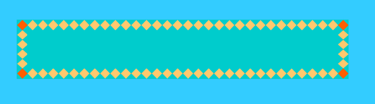
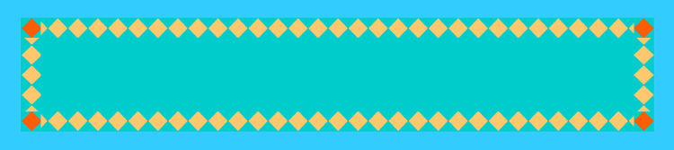
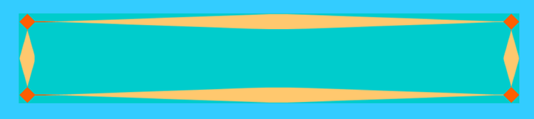
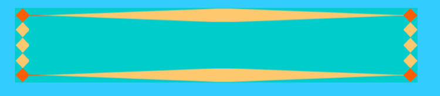
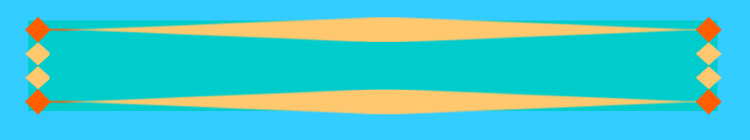

title: 轻松入门css3之border-image      
date: 2014-10-05
tags: [CSS]
categories: [CSS]
toc: true
---

话说大家不管用过没用过，对border-image应该都有所耳闻，相比css2.1，css3的新东西那么多，为什么要挑这个来说呢，因为我个人经验来说，这个相对来说较难理解。那它到底是什么，又怎么用呢，有哪些需要注意的地方？这方面也有书籍和文章讲，如果你看过，却觉得没搞懂，也没弄明白怎么回事，那么希望这篇文章可以帮到你！我不会按常理出牌~

首先要跟大家说的是，不要先入为主的走入一个死胡同，不然很难走出来，图片边框，跟使用线型边框的时候不一样，这个思维要转换过来，使用线型边框的时候，你只需要设置“边框宽度”、“类型”和“颜色”。那么边框就出来了，使用图片的时候你可不能照搬，它有自己的一套规则，所以，请清空你的脑袋，忘却才能更好的学习（这话好像在武侠片里比较常用）~

你需要掌握的要领只有两点：

一、图片裁剪的方式
二、为什么要裁剪，裁剪完之后做了哪些动作？

## 先来说第一点

不要觉得这是有多麻烦，多深奥，大家都玩儿过一种智力游戏吧，叫做“你能用几刀把一个正方形切成九块？”或者说“只用几刀你能把什么切成多少块”，等等。图片裁剪是一个道理，是不是瞬间觉得亲切很多？它就是横竖各两刀来把你所选取的图片切成九份，就是很多资料里说的“九宫格”模样，是怎么切的呢？注意，切的次数是4，这个数字蛮熟悉的吧，margin、padding、border等这些都是有四个方向的规则吧，此处也一样，遵循上、右、下、左，那是怎么测量的呢？你应该猜到了，是从边缘向里测量，也就是上边缘向下，右边缘向左，依次类推。像其他规则一样，你同样可以简写之，写一个，两个、三个都没问题，有注意事项会在下面奉上！~

## 再说第二点

或许会有人说，我看你说怎么测量，怎么裁剪，头都大了，到底是要干嘛啊？我就用个边框还搞这么复杂。相信我，并不复杂，为了更好的说明裁剪完成之后干嘛，来拿张图片，这也是w3c教程网的图片

先这么粗糙的给大家画一幅，已经切成九块了对吧，那接下来，要干嘛呢，要发功了！呵呵，开玩笑。

图片边框的绘制进入了最后一步，也是最关键的一步：

切记，四个角是不动的，也就是说，当你应用了这个图片作为边框，四个角还是红色菱形，你也控制不了它（除了尺寸）。那中间呢，中间也是不显示的，大漠哥的文章里把它称为“盲区”，是的，拿掉！就只剩四个黄色菱形了。接下来，我们就来正经的讲一下，会发生什么。我做一个形象的比喻吧，给元素加上这么一个边框，就相当于找了一个图片，然后按你想要的区域把中间掏空，接下来向四周撑开！

来看一下格式：
border-image:url(图片路径)    裁剪尺寸   裁剪过后的显示方式（就上图来说，就是四个黄色菱形的排列方式）

排列方式有三种round、repeat、stretch分别来看一下是什么效果

round（平铺）

    .box{border-image:url("../images/border.png") 27 round;border-width:27px;width:800px;height:100px;background:#0CC;}
  
效果

 

repeat（重复）

    .box{border-image:url("../images/border.png") 27 repeat;border-width:27px;width:800px;height:100px;background:#0CC;}

效果

 

stretch（拉伸）

    .box{border-image:url("../images/border.png") 27 stretch;border-width:27px;width:800px;height:100px;background:#0CC;}

效果

注：IE开发者平台还给出了另一种方式：space，据我测试，跟repeat没看出来有什么区别，你可以试试，如果有新发现欢迎交流~

好吧，三种展示完了，相信用过背景图片或者设置过电脑桌面图片的人，对平铺和拉伸都很熟悉吧，这个不难理解。现在该说注意事项了。

短短的一段代码到底藏有多少玄机呢？（故弄玄虚了哈~）

1、图片路径一定不要错，可为绝对或相对路径
2、大家应该注意到裁剪的数值，用了27，这是因为图片的宽高均为81，使用27能把它的边进行三等分，剪出三个完整菱形，说白了就是好看，你想用多大用多大，这个不影响你成功的使用它，当然，要在原图尺寸范围内，你也可以尝试0或者81是什么效果~另外，它没带单位，是的，它默认单位就是“px”，带上单位反而会错！！
3、使用显示方式的时候你可以只写一个，就像我上面那样，也可以写两个，但切记，你不能以此类推的说，可不可以写三个或者四个呢？不行！不仅诸如 round repeat stretch这样的不行，round repeat round和round repeat round repeat这样看似合理的也是不行的！！当然，你不写也可以，默认值是 stretch。

给出stretch round 结合的效果，注意，前面一个控制上下，后面一个控制左右。

4、边框的宽度，首先这个是必须设置的，不然是不会有任何反应的，另外，边框的宽度和原始图片无关，原始图片只是你用来做选取的，你所设置的边框宽度比选取的部分更大或者更小都没有关系，可以是任意的正常数值，你所选取的部分图片会等比例缩放以正常显示

以上四点，便是需要注意的基本的东西，任何一点出错你都将看不到任何效果，如果你在练习的时候出现问题，可以先检查一下，另外，注意单词的拼写这样的低级错误不要犯。

其实，你还是会有一些困惑的，不是么

## 一、repeat和round怎么那么像呢，有什么区别呢？

是的，这哥俩是很像，你也可以看出来，repeat似乎不像round那么完美，是会在两端留有瑕疵的，我们可以看做是它仅仅承担了重复的任务，而且是有中间向两端进行重复，而round不仅承担了重复的任务，还平衡了一下总宽度和所选取部分图片的宽度，让图片刚刚好能完整的平铺。

## 二、为什么不能直接选择一个图片，控制大小，控制水平、垂直方向的显示方式就完事儿了呢？

 如果真的是那样的话，也没什么不可以，但是现在这种做法能完成更多更有意思的东西，而且，使用好边框图片需要做好两件事情，第一是做出一张好的图片，第二是以你想要的方式进行裁剪，这样赋予了它更多的灵活性，而且，如果你有足够的好奇心和创造力，它的强大超乎你想象！上面只是一个简单的实例，如果你想，你可以把四条边和四角换成任意图象，这都由你来决定！~比如上例，你把菱形全都做成红色或者黄色，那么就是一个四边完全一致的图片边框了，so easy！~

说了这么多，上面是要做出边框的必备事物，该献上border-image的完整格式了

border-image: url("图片路径") 裁剪尺寸 /边框宽度 /边框图象超出边框的量 显示方式;

看到这个你会说，怎么比刚才多出两个呢，是的，这个是把所有的都缩写到一条规则里了，而且要按照格式来，比如“/”是
不能去掉的，不然整条规则又一命呜呼了，那边框图象超出边框的量是什么意思呢？我们所设定的边框图象是占据了所定
义的固定宽度的空间，默认超出为0；下面给出超出5px的样子。

    .box{border-image:url("../images/border.png") 27 /30px /5px stretch round;

看到区别了么？四边都超出去了5px，作为常理，像这种用来控制距离的东西，可以正
就可以负咯？不好意思，这个真没有！~但是它可以遵循上、右、下、左的规则，也可以简写。

总结，如果你想简写

border-image: url("图片路径") 裁剪尺寸 /边框宽度;

这个组合就是必须的了。其他用来锦上添花。

说了这么多，不知你是否已经明了？如果还是没明白，那么请动手做一下吧，只要提到的那四条注意事项不出错，基本就没问题了。另附大漠哥文章[css3-border-image](http://www.w3cplus.com/content/css3-border-image)，个人认为，你先能做出来基本的效果再看收获会更大，还有惊喜，不然可能很晕。

IE开发人员中心[相关内容](http://msdn.microsoft.com/library/ie/dn384064.aspx)

欢迎一起交流学习，加入我的企鹅群你将得到更多哦！~web前端~美是编出来的：152128548