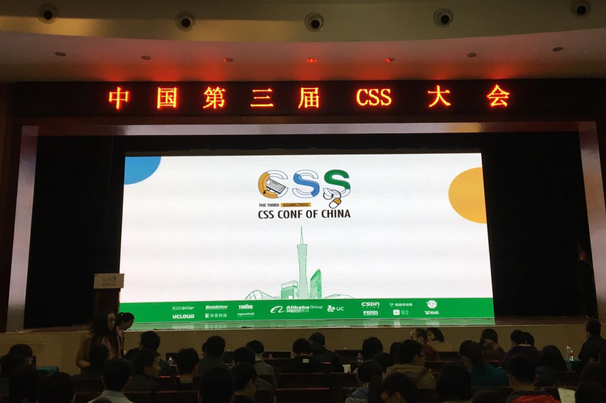
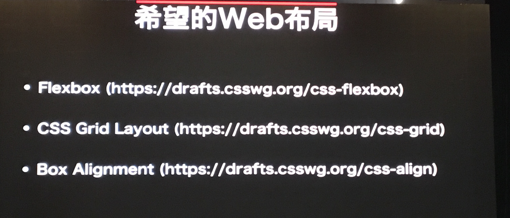
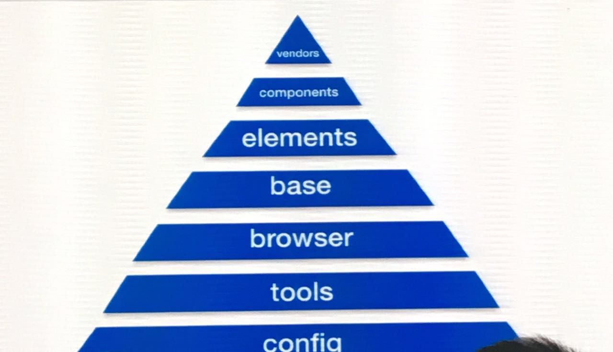
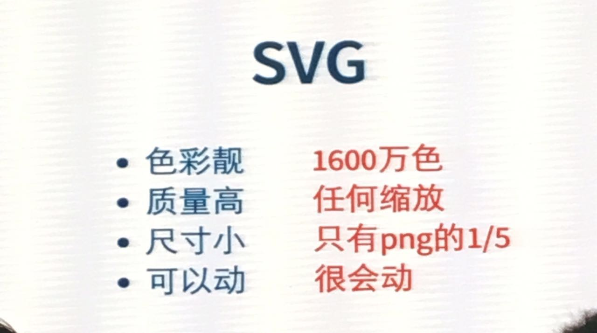
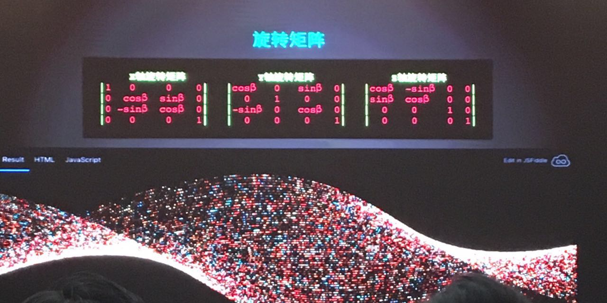
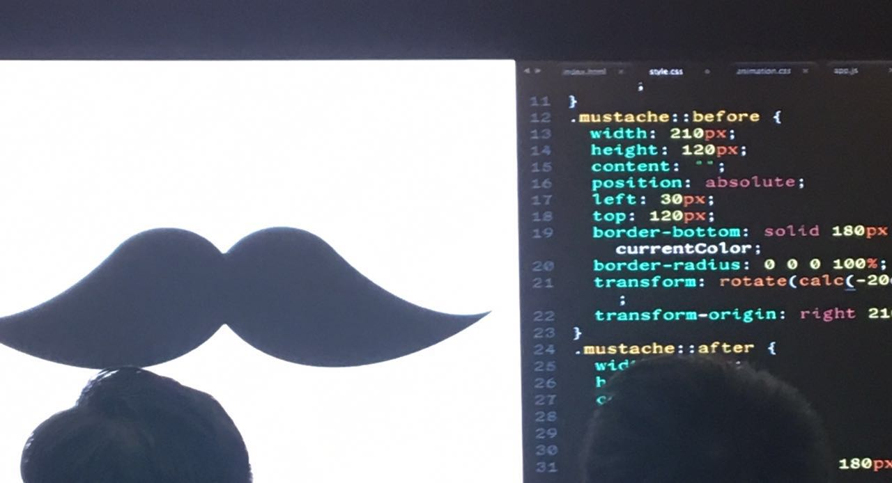

title: 第三届CSS中国开发者大会纪实         
date: 2016-12-18
tags: [分享交流]
categories: [分享交流]
---

不算几次路过，这是我正儿八经第二次来广州，每年的这个时候，南方还是阳光明媚，12月17日，第三届CSS中国开发者大会，就在这样一个温暖的早晨开始了。

此次大会举办地谈不上高大上，甚至比较偏，但会场内环境和规模尚可，400人左右。

今年是CSS诞生22周年，在会议的开头，特地播放了CSS之父Håkon Wium Lie录制的一段视频，其简单提及了CSS的发展历史和现状，并对CSS的未来有更多期许，希望大家能带着它挑战更多现在尚未触及的领域，挑战更多可能。

## 一、3.14 Things I Didn’t Know About CSS——Mathias Bynens
第一个分享的是位外国友人，我虽然大学英语过了六级，但英语这个东西，不进则退，更何况是听力，还有很多专业词汇，所以，不得不承认很多没有听懂，但大家都是程序员，代码是通用语言，演讲者的代码演示依然给了大家不少冲击，大多是我们平时没注意到的东西或者没有用过的用法，还有比较一些大家平时有用到的方法的优劣和规范与否。

比如：!important的用法、CSS注释的用法、font-family有什么讲究、非常规选择器 Escaping css selector、CSS表达式  css expressions in IE<7、IE legacy document modes、Freeze Firefox等等，诸多的细节，每一个都能让人感叹，引人思考。

里面提到的两个网站大家可以欣赏一下。

[youmightnotneedjs](http://youmightnotneedjs.com/)和[HTML KONG](http://kong.xn--8ws00zhy3a.com/)

## 二、CSS Grid Layout——大漠
现在大量网页设计基于网格布局。虽说人们通常注意不到它，无论从理论、美学和整齐来说，这样的布局都很好平衡。网格结构是所有现代网站的基础，它总能给最终用户完美无暇的设计。

大漠给大家介绍的Grid，相信很多人挺早就有接触，但因为浏览器对它的支持还不好并且看起来能够大胆使用还遥遥无期，就没有更深入去了解和实践，为了到会场之后不会在演讲者快节奏的讲解下一脸茫然，去之前几天，我借助着Eric Meyer那篇文章以及扩展阅读，稍微把Grid又过了一遍，对整体有了大概的了解，但文章终归是文章，和PPT以及现场嘉宾讲解还是会有不同，大概的定义和概念就不必多说，重要的是看它的亮点以及能够用什么巧妙的方法解决什么问题。

其称为“网格系统”，当然就有它强大之处，强大在它不像行高、浮动这些属性只是对一些具体区块的影响和作用，它能够把整个网页都规划进去，而且在不变动HTML的情况下大幅度改变布局。就像很多人认为的那样，这跟当年很多人热衷的table从外表上看有点像，但又有本质的不同，网格较之更加强大和灵活，首先，不需要特殊标签，只是属性，另外重点在于，强大的属性值选择，怎样分配行和列、区域，怎样高效的书写，怎样智能的计算，等等。

大漠也对未来的布局大势做了些前瞻

了解过的人都会有一种感觉，Grid跟Flex box有相似之处，那么，它俩该怎样选择，会是替代关系吗？

在现场，大漠对这一点也做了解读：

Flexbox   定义一个维度、内容更擅长，比如，一个容器里的图片和文字排版

Grid Layout   定义两个维度 外部大布局更适合，比如，各种大模块的排布

总之、Grid是对CSS技能包很好的补充，而不是矛盾或者冲突关系，技术在人的手里，可以灵活运用。

## 三、闪电分享——勾三股四
第三个话题，由勾三股四带来的闪电分享 Css in Native。之所以称为闪电分享，是因为时间很短，所以，语速也很快。

说实话，内容跟CSS本身相关的东西不多，多是关于Weex的介绍，有点广告之嫌哈，但Weex出来之后的确曾引起行业的广泛关注，我们组也不例外，不过过了那阵儿就没有太多关注了，可能很多人和团队也都是这样吧，这个跟自身的业务项目相关，但作为个人去了解和学习是可以的，其演讲对时间的精准控制和流畅度给人留下深刻印象，跟主题相关的是讲了Weex中是怎么写CSS的，以及对原生CSS属性的支持情况，具体等资料放出来大家再细看吧。

## 四、Sass & CSS Design Pattern——廖洧杰
如何设计出灵活性高、易维护的网页版型，一直都是大家憧憬的目标。这个话题是我比较感兴趣的，因为是我们团队正在使用的方案，演讲者先是列了一些数据，关于大家平时写代码的规范性和意识的统计，比如使用的工具（Sass）、设计模式（BEM）、CSS的命名规则等等。

重点是提到的一个金字塔：

自底向上，不同层面，从整个项目的高度去考量，一步步构建出这个金字塔，看似简单而顺理成章，其实是需要很多的实践和思考。

这部分内容，应该能和很多人脑子里的想法发生碰撞。具体如下：

vendors：第三方插件  jquery plugin  inbox

components：组件

elements：元素/原子 ——分子（模块）——机构

base：预设样式，全域样式、减轻各类设定负担、前端和设计共同讨论

browser：浏览器，reset差异

tools：开发资产、积累、成型方案

config：全域变量 、档案路径 、前端任务 gulp等   

这些环节，其实就是一个项目从无到有的过程，对于基础阶段的朋友来看，可能有些费劲儿，但细细品味一定会有所悟，也可以借一步看下我前段时间写过的另一篇文章明白了这些，你不仅仅能成长为优秀的UI工程师会有一丢丢的帮助~

在谈论这个话题的过程中，演讲者插入了一大段不同角色和团队眼里的职能和所关心的侧重点，比如：

1、只写前端的，会更注意到什么

2、既懂设计又懂前端的，会是怎样

3、分工比较细致，团队协作，快节奏的，又是怎样

这些能让处在不同角色和团队的人感同身受。其中有一段说，好的设计师要考虑什么：自适应布局、图片格式、状态、页面回馈、元素动画效果描述、WebUI 种类。我觉得这会令很多设计师汗颜，因为据我所知，相当一部分的设计师是考虑不到这些看起来更偏向于开发范畴的东西，能考虑到这些，对前端或者UI开发来说应该是很幸福的。

## 五、微信网页重构实践 && SVG工程化与动画实践——罗正烨、方潇仪、倪栩生
这个话题讲了SVG在项目中的应用。SVG就像Grid一样，大家早有耳闻，但应用一直都不太普遍，像是一直在圈儿外打转一般。

这个环节是由微信的三个同事来进行的，基础的东西不必赘述：
第一位主讲了“什么是SVG，为什么用，怎么用”。这些，其实大家可以通过上网和书籍去查阅。

SVG优势如图：

大家都知道我们在实际开发中会遇到的痛点，常常做了很多代码层面的优化，但到头来顶不住几张很大的图片，整个文件就显得很大，另外就是虽然CSS3在视觉和动画方面已经做了很大的提升，但有些动效实现起来还是很困难的，故而，很多场景下，SVG能成为一个很不错的替代方案。

第二位，主讲了SVG的各种动画效果和大概的实现细节，比如：描线、变形、路径运动、图案填充、滤镜。还通过简单的代码展示，介绍了是用哪些属性如何实现的，对刚接触或者还尚未开始接触SVG的朋友应该帮助蛮大的，它会告诉我们，那些很炫的动效离我们并不遥远，而且一点也不难，会让人忍不住马上去尝试一番。当然，首先要掌握一些基础，然后就是发挥自己的创意了。
第三位，讲了信息和网页的关系，网页是信息上下文的情景重现。

网页特征：多平台、可访问、可用

信息在网页中的形态

意识形态：元信息  一个信息仅有一个意识形态，就是网页结构中独一无二的内容。

实体形态：标记

表现形态：样式

在我看来，相当于是对网页内容重新进行了一下抽象和归类的描述。

## 六、从矩阵走入 WebGL 世界——陈剑鑫
这个话题，我没有学习过，也知道它没那么简单，这涉及到硬伤——数学和物理，嗯，不是懂几个属性就能解决的，没有多方面综合而来的能力和技巧，做出来的东西也是不堪入目~所以，也没有临时抱佛脚，就权当去现场感受一下它的魅力了。

抛出来几个概念你们自己感受吧。

矩阵matrix transform基于矩阵实现效果            

欧拉角rotateXYZ              

四元数rotate3D

演讲者在现场也演示了几个运用这些技术做出来的炫酷效果，这是其中一个

## 七、CSS animation && CSS: The secret drawing tool——Wenting Zhang
来参会之前，就已经看到过演讲者的站点，但是说实话，人大多数情况下都是懒的，再加上精力有限，对很多东西会一扫而过，我所看到的网站和演讲者自己演示出来的相比少了很多亮点，有很多“秘密”没有发现，具体大家自己去发现吧~ [cssicon.space](http://cssicon.space/#/)

演讲者以现场写代码的方式，写出一个可爱的胡子来开场，像这样

胡子本身并没有多少难度，利用圆角和阴影以及伪元素和定位等，大家都能画出来，但是，当这些东西，结合着CSS变量和calc函数，以及少量js的事件，便能产生出让大家惊叹的效果，你会觉得，原来看起来那么炫的效果其实这么简单就能做出来。

我的感受是，画icon是个简单的事，但如果画了512个，还给它们安了个家，不仅如此，还特地花了一些功夫，增加了非常赞的体验，就是一件很不简单的事~

## 后记
期待了几个月，提前一天抵达广州，带着本子做了一堆笔记，事实证明不虚此行。或许因为个人工作的局限，或许因为懒惰，我们总会有一些东西尚未发现，然后一步步地走到了技术和心理的双重瓶颈，有人就觉得迷茫，不知道下一步该把精力放在哪里，这个时候，能够借助一些更加优秀或者比我们做了更多尝试的人的视角，去看一看未知的区域，对我们每个人都是个激励。

尝试更多东西，找到更多精彩，这不正是我们编程人员工作的乐趣和初心么~

感谢大会的组织者和所有工作人员，期待下一次的精彩。

另附一个无意间看到的CSS二十周年作者专访 [CSS: It was twenty years ago today — an interview with Håkon Wium Lie](https://dev.opera.com/articles/css-twenty-years-hakon/)
