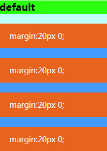

title: margin那些事儿         
date: 2015-08-07
tags: [CSS]
categories: [CSS]
toc: true
---

## Margin是什么？

Margin这个概念本身并不难，我也不想把它说的多晦涩，会css的都知道box盒模型，它就是盒与盒之间的间距，俗称外边距，也有叫外补白的，这些不重要。是的，它就是这么简单，但是，它又是怎么兴风作浪的呢？

在刚接触css的时候，有个小师傅告诉我，能用padding的地方就不要用margin，容易出现问题，我当时是谨记在心，以至于后来在挺长一段时间，也不知道会有什么问题。人就习惯于用“有问题”来概括一个还没弄明白也没找到解决方案的问题，当然这是消极的，我们应该面对问题，解决问题。

## 会有哪些问题？

**问题一：外边距叠加**

关于叠加，已经有非常多的人提问，也有过非常多的解答。

这里不再赘述，但可以大概说一下：

**一言以蔽之：两个或多个毗邻的普通流中的块元素垂直方向上的 margin 会折叠**

有几个关键词：

**块元素**：这里可以稍微说一下，大家都知道行级元素跟块元素是有区别的，所以，大家可能经常采用display：inline-block；使其块级化（其他方法这里不谈），然后就对其随意的做各种块级元素才能有的动作不亦乐乎，那么这里就是要说的是，作为行级元素，它可以做到的是border、padding、水平margin，不能做的是width、height和垂直margin，有时候不必盲目的去把它块级化。所以，回正题，这里要是块元素，不然叠加无从谈起。

**两个或多个毗邻**：有人可能认为挨着排列的同类元素才称为兄弟，这是一种惯性误解。这样的误解同样存在于js的当中的兄弟元素，所以，应该首先跳出这个区域，才能更好的看待叠加，当然margin的叠加也不仅是同级的元素会，父与子也会，甚至能够再向外延伸，也就是说，它具有“穿透力”，仿佛盒子没了边界，什么样的边界才能称作毗邻呢？只要两个容器之间没有被非空内容、padding、border 或 clear 分隔开，那么就可以称作毗邻。 当然，还有一种特殊情况，那就是空元素自身的上下边距，也会重叠。

普通流：大家都知道，float和绝对定位等情况会使元素脱离普通文档流。

垂直：叠加只是垂直方向会发生，水平则不会。

代码：

    <ul class="menu_list">
      <li>margin:20px 0;</li>
      <li>margin:20px 0;</li>
      <li>margin:20px 0;</li>
      <li>margin:20px 0;</li>
    </ul>

效果：

那么如果不想它叠加怎么办呢？

可能很多人马上脑海里就会出现那三个高大上的字母“BFC”。

那么，**触发BFC的方法是什么？**

float（除了none）、overflow（除了visible）、display（table-cell/table-caption/inline-block）、position（除了static/relative）

大家都知道要想解决问题，把它会出现的条件给避开即可，那么“BFC”就是答案么？有人已经给出了demo，不妨来看BFC不只是解决叠加的答案

是的，解决外边距重叠的方法是触发BFC方法的子集，而并非等同。也就是说，有些方法并不能完全消除掉叠加现象。

**但答案到底是什么呢？**

1.浮动元素、inline-block 元素、绝对定位元素的 margin 不会和垂直方向上其他元素的 margin 折叠（注意这里指的是上下相邻的元素）

2.创建了块级格式化上下文的元素，不和它的子元素发生 margin 折叠（注意这里指的是创建了BFC的元素和它的子元素不会发生折叠，与上面的demo并不冲突）。

但是，我们在解决这些问题的时候，都是为它们添加了额外的规则，这些规则所造成的影响和去除影响的代价也是不可估的，那为什么不从源头上去避免叠加的发生呢？是的，能用上下边距来进行的布局一般都能使用单方向外边距，所以，“消除叠加，不如本来就没有叠加”~

话又说回来，其实这个叠加，并不能说是个真正的问题，因为它是有设计初衷的，我们把它看做是问题，才觉得它有问题，如果从另一种角度来看，一个容器里面有若干子元素，叠加的结果就是，各子元素之间等距，父容器上下也都有叠加而来的等值外边距。这其实是个挺合理的效果不是么~

好了，更多相关的东西，比如叠加如何计算等，可以参考下面两个网址的内容：

[Css框模型](http://www.w3help.org/zh-cn/kb/006/)

[IE6 IE7 IE8(Q) 中浮动元素和绝对定位元素某些情况下会影响普通流中毗邻 ‘margin’ 的折叠](http://www.w3help.org/zh-cn/causes/RB8004)

**问题二：双外边距**

场景：

1、IE6

2、block元素

3、float

4、margin

5、浮动和margin方向相同

比如下面

    <ul class="menu_list double_margin">
     <li>margin-left:20px;</li>
     <li>margin-left:20px;</li>
     <li>margin-left:20px;</li>
     <li>margin-left:20px;</li>            
    </ul>

li设置左浮动

IE6下效果如图

明显可以看到最左侧的边距为右边的两倍。

当然，这个bug可能现在会见到越来越少，因为IE6的“消亡”，还有就是滥用浮动是一种不好的布局习惯，所以，用了其他方法它也不会出现了。另外有一点可能造成误解，就是浮动会使行级元素块级化，那么为什么这里要block和float同时满足呢？不信你可以试试，同样条件下，span是没有双边距的。或许，这也就是为什么display：inline可以干掉这个“bug”的原因吧~

好，除了不浮动，那么还有一种方法，就是不满足第5条，让浮动的方向和margin反向，下面会讲到利用了第5条做出的一种经典布局方式。

上面说了问题，那么margin有哪些有用的用途？

下面举几个实际中的例子

## 了不起的负边距

**水平居中**

我们经常会想要一个不管怎样大小的屏幕分辨率下都居中的元素，而且还不能够使用惯用的text-align:center;和margin:X auto;那么这个时候就需要定位了，position：absolute；设置left值，可是，设置多少呢？因为left的值是与容器左边界为标准的，而不是容器的中心轴，所以，这个值没办法设置，于是乎，margin登场，我们可以采用一个和目标容器同等宽高的容器来包裹住目标容器，然后对包裹容器进行绝对定位left：50%，top：50%，最后，对目标容器采用margin：-50% 0 0 -50%；这样的话，目标容器就刚好居中了。（采用定位也可以实现，这里不讨论哈）。这个方法有个局限性就是要定宽，至于不定宽的方法，可以看一下我写的另一篇“不定宽居中的几种思路”~

**不规则的布局**

比如我们平时所理解和看到的盒子是矩形的，有时会看到一个元素，它既不属于上面的盒子，也不属于下面的盒子，而是在中间的，这怎么办呢？ 负边距是个不错的选择，可以设置成你需要的值让它“出去”，当然，如果你不凑巧同时使用了overflow：hidden，那就只能呵呵了。（ps；这里提到的效果同样可以用定位，不谈~）

**等间距列表**

这个你没遇到过？反正我是不信~每个人都会遇到它，而且是经常遇到，一个头疼的事情来了，想给每一项都设置“margin-left” or“margin-right”，可是，最左侧和最右侧的元素怎么办？就会被挤下去了。或许你有下面几种办法。

1、单独加style

2、单独给类

3、用：first-child或者：last-child，再或者：nth-child

很好！你居然有这么多办法，可是，不觉得前两种方法很牵强，那么还有第三种，but，你确定不考虑兼容？ 好吧，不卖关子了，使用margin负值可以解决它。给子元素定义margin-right，父容器定义margin-right负值，具体的值要看具体情况了，为什么这样可以呢？实际上它是改变了元素的宽度使得空间足够了。

干掉空隙

比如之前谈到过的display：inline-block所产生的那点间隙。不再多说，技术运用在于我们的发挥了~

下面就来看一个大招

## 双飞翼布局

这种布局方式貌似最近又活了一把，好吧是一直都火，堪称经典的一种布局方式，说实话，也是我进入职场之后，老大交给我的第一种方法。

下面请看代码

    .main { 
       float: left; 
       width: 100%; 
       background:#39c;
       height:300px;
      } 
    .sub { 
       float: left; 
       width: 480px; 
       margin-left: -100%; 
       background:#f60; 
       height:300px;
      } 
    .extra { 
       float: left; 
       width: 190px; 
       margin-left: -190px; 
       background:#666;
       height:300px;
      }

    
 
       

 
       

 
       

    

效果如图：

当时很菜，看了好几遍都没明白到底是怎么回事，自认为的一个在左边，一个在右边，应该是float：left和float：right吧，却不是，那总应该是个margin-left，一个是margin-right吧，也不是，好奇怪的赶脚啊！~后来，老大跟我画图讲解才恍然大悟。然后想，布局要搞得这么神奇呀，以至于后来用其他方式的时候都会有些怀疑自己用的方法思路是不是太简单了，有问题吧？~

当然，这种布局运用到了float和margin负值，而且很是方便，两栏、三栏、栏和栏之间交换等，那都是分分钟的事情。当时我要使用别的方法的时候，老大就会白我然后说道：你能保证不出问题么？ 好吧是的，这种方法优点很多，比如：

实现了内容与布局的分离.

main部分是自适应宽度的，很容易在定宽布局和流体布局中切换。

任何一栏都可以是最高栏，不会出问题。

需要的hack非常少（就一个针对ie6的清除浮动hack:_zoom: 1;）

在浏览器上的兼容性非常好，IE5.5以上都支持。

故而历久弥坚~

元素间的空隙或许到什么时候都是需要的，它代表着元素相互之间的一种独立，能使页面看起来更加的有结构感，更清晰，那除了margin还有什么选择吗？

可期的未来——“摆脱”margin

Css3提供了很多新的方法来进行布局，看起来也更加灵活和智能，比如Flex box（伸缩盒），Multi-column（多栏）和Grid（网格）等。那都是棒棒哒！~

好了，今天关于margin的问题先谈到这里，说的蛮多了，其实还有，也可能有疏漏，欢迎大家骚扰。

另外，可以有以下两种方式找到我

QQ群：152128548

微信公众号：前端周末

咱们下周见！