title: 浅析line-height和vertical         
date: 2015-06-19
tags: [CSS]
categories: [CSS]
toc: true
---

line-height

通常被我们用来干嘛呢？

比如：height：*px;line-height:*px;是这样的么？我们常常用它来对文字进行居中。为什么这样就能居中呢？因为行高是元素基线之间的距离，行高会减去字体的高度然后上下平分去建立一个行内框（inline box），如果这个时候高度和行高一致，自然就体现为居中。那么它有什么可研究之处呢？

比如：有时候设置了line-height却仍然不能将内容居中怎么办？设置了vertical-align：middle;没用是为什么？

先来概览一下：line-height

在块级元素，将line-height属性指定的线框元素中的最小高度。

在非替换行内元素，行高指定用于计算行框的高度值的高度。

在替换的行内元素，如按钮或其他输入元件，行高没有任何效果。

这里出现了应该注意的第一点，行高作用的是高度。

意思是可以不设置height？Yes。我们通常会认为当我们给一个空的容器填充了文字，即使我们没有给容器设置高度，文字也会把容器撑起来，其实不是，它是由和文字相关的一些属性的设置以及line-height：normal来决定的，而且这对块级元素和行内元素的影响不同。

先给出试验的原始图作为参考

Code 

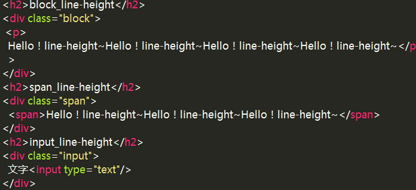

每个div设置了20px内边距，为下图的绿色部分，font-size：16px;

效果 

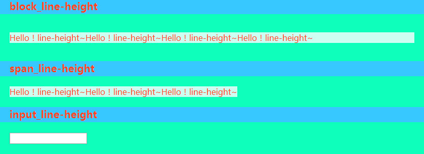

我们给p设置line-height：0；overflow：hidden；

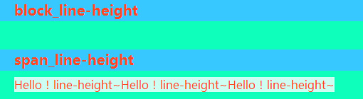

可以看到，此时p“消失”了。但也会惊讶的发现span这里完好无损，来看浏览器告诉我们的

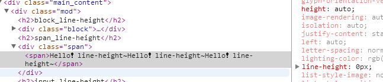

是的，它的line-height同样被改变了，但是高度却不为0.这就是对行内元素的影响。行内元素的行高会跟着改变，但是它的高度不会变。

line-height取值

值：

normal

inherit

带单位的数值，如:20px(同样可以使用存在且合理的em、rem等);

无单位值，如:2;

百分比值：如:150%;

和什么是相关的？

font-stretch、font-variant、font-style、font-weight font-size、font-family

一个个的来看 Normal=？ 在什么都不设置的情况下，normal是多少？应该是1吧？就像我们猜测z-index在不设置的时候默认值是0一样。看看便知

Normal

1

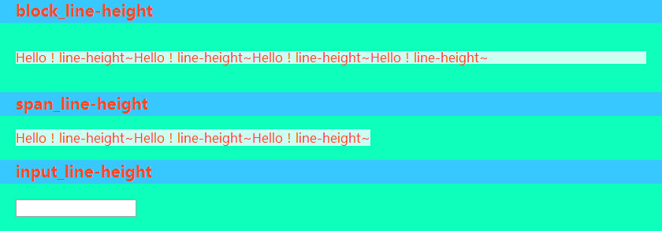

不一样啊，那100%呢？

看起来纹丝未动哈。可能有人会问，1和100%不是一样的么？！可真不一样，后面讲。

那normal是多少？

不能靠猜哈！它在不同浏览器中的计算值也是不同的，有资料说它取值是在1.1-1.2之间，css权威指南上也说是1.2倍，据我测试，在chrome下，等于line-height：1.32;

Inherit

继承，跟上例相关，line-height会怎样继承？先看数值

数值分为带单位和不带单位的

带单位，其实这个就很直观了，你定多少它就是多少，就跟我们js当中所说的字面量一样。But，只是对于px、pt等具有物理标准的单位，其他的后面讲。

不带单位

这里面就牵扯到一个继承的问题，上面有提到1和100%是不同的，原因就在于此。不带单位的数值，它是将这个数值作为比例传递了下去，至于后代的行高是多少，则是由后代的font相关属性决定。咱看图举栗子~

其实上面已经贴了一张图。那里的1和100%一样的，为什么呢？因为font-size被继承了下来，这个时候继承的是数值还是比例就没有区别了。 如果是不同的呢。

比如我mod行高设置为1.5;p的font-size：18px;再来看

当我们只改变了数值

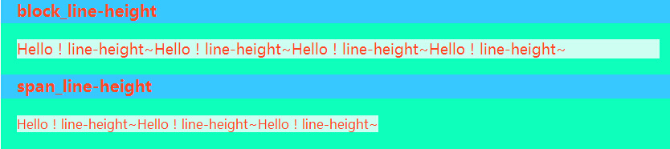

这看起来好像没有太大变化，但我们来看二者的区别

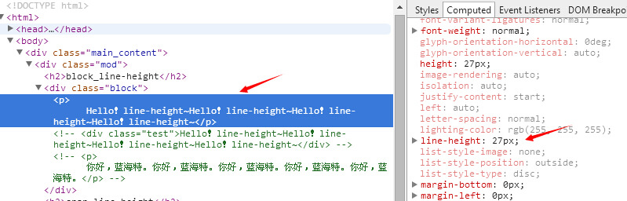

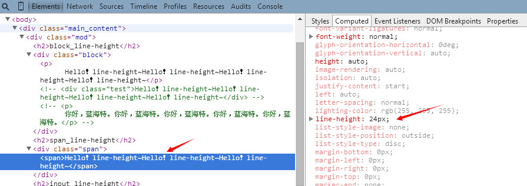

这时p的行高line-height=18*1.5=27px，span部分的行高 line-height=16*1.5=24px;

是的，当line-height为不带单位的数值时就是这样。

那么。。。当它是1.5em的时候会是怎样的？会是一样的么，我们给它们的父级元素设置1.5em； 如下：

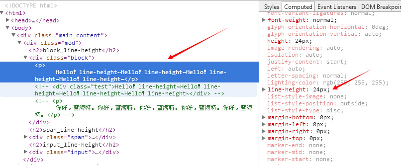

呕吼！看来浏览器这时候没有理会p的18px，而是用了父级的16px。

下面看百分比

百分比和无单位数值从数学的角度来看没什么区别，这可能也是多数人看到这两个最困惑的一点，人总会根据自己的经验来判断一些东西。往往具体的事物有着具体的规则，会有差别。对于line-height来说，前面说了无单位值是继承了比例，百分比则是继承了行高的值，也就是说，这个时候父元素的行高决定了下面所有，当然，前提是子元素没有定义行高。

为了验证我们的想法，给父元素设置line-height：150%;/子元素不设置，如果如我们所料，行高应该都是24px，来看结果，

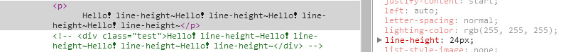

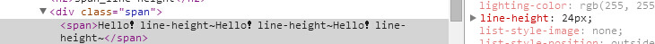

看来是这样的，当是百分比的时候，它们继承了父级的line-height值。

好了，至此，我们看到的都还是正常情况，那不正常情况呢？比如

行高小于字号

我们给line-height:0.5; 这个时候会出现什么情况呢？

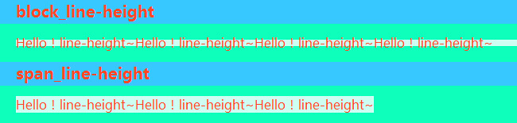

p的行高会缩很多，同时高度也跟着行高变化，但span的高度未发生变化。正如上文所说，它的高度不会被line-height改变。

但行高确实变了

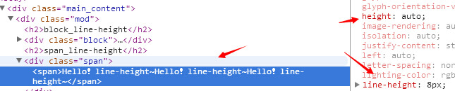

做一个小结：

1、行高会影响块级元素的高度，而不会影响行内元素的高度。

2、1和100%和1em不同，虽然它们看起来都是比例，但对象不同，所传递的东西不同。1是把比例传递给后代，100%是将计算后的值传递给后代，1em则会使元素以其父元素font-size值为参考来计算自己的行高。

vertical-align

好的，下面看看vertical-align吧，也该它登场了。

通常我们用它是干嘛？是的，有时候我们想很爽的像text-align那样用它来进行垂直居中，因为居中的用处实在太广了，它代表着一种对称美。

Value

长度 通过距离升高（正值）或降低（负值）元素。’0cm’等同于’baseline’

百分值 – % 通过距离（相对于1line-height1值的百分大小）升高（正值）或降低（负值）元素。’0%’等同于’baseline’

baseline 默认。元素的基线与父元素的基线对齐。

sub 降低元素的基线到父元素合适的下标位置。

super 升高元素的基线到父元素合适的上标位置。

top 把对齐的子元素的顶端与line box顶端对齐。

text-top 把元素的顶端与父元素内容区域的顶端对齐。

middle 元素的中垂点与 父元素的基线加1/2父元素中字母x的高度 对齐。

bottom 把对齐的子元素的底端与line box底端对齐。

text-bottom 把元素的底端与父元素内容区域的底端对齐。

inherit 采用父元素相关属性的相同的指定值。

它对哪些元素起作用呢？

只有一个元素属于inline或是inline-block（table-cell也可以理解为inline-block水平），vertical-align才会起作用。

那么它是什么，怎么起作用的？

从各种取值的描述来看，它对于元素本身的表现并无影响，而是影响的在垂直方向的位置，而这个位置是其自身相对于上下文的元素的位置。

那么就好理解一些了，找找位置即可。

默认值为baseline，即子元素的基线和父元素基线对齐。因为让所有文本元素的底端对齐是再正常不过的需求。其他的呢？

我们拿label来看，为了能看得更清晰，我们用一个input来对比，这恰巧也是我们的常用组合。

把label的font-size设置为30px。

值当中有几个是比较好理解的，比如

top 

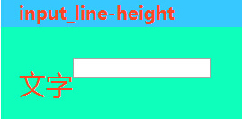

bottom 

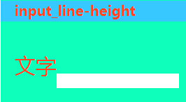

text-top 

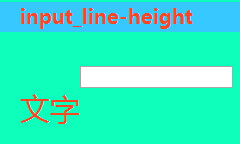

text-bottom

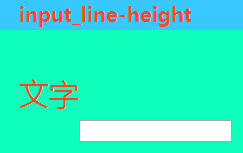

middle 

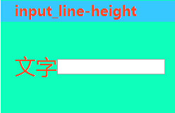

那么sub和super该怎么理解呢？

这个在某些时候会引起误解，因为你可能设置的super的时候，文字看起来比sub的位置还低，这是因为字体和行高的影响。其实大家是不是会对它们有些眼熟呢？对，html有两个标签是用来负责设定上、下标的，那么这两个是不是同理？ 来看看便知，因为我们给父元素定了无单位数值的line-height，所以字体大小会影响行高，进而影响到基线和对齐的效果，所以我们将font-size:16px;来看效果。

super

sub 

It’s true!~

对了，还有百分比和长度

百分比的位置依然是从基线算起，而不是我们已经习惯了的顶部。正值会使元素向上移动，负值会使其向下移动，这跟其他值比如margin和定位又不同。当其顶部或者底部超过了同级元素的最大行高，则会影响到整体的高度。

长度和百分比类似，以基线为标准，正值上移，负值下移，超出最大行内框的高度则撑起外围容器的高度。

想玩儿的话，张老师有个页面可以玩玩儿[vertical-align](http://www.zhangxinxu.com/study/201005/verticle-align-test-demo.html)

另外大家可以到MDN和strick上面看看相关的内容

[mdn-line-height](https://developer.mozilla.org/en-US/docs/Web/CSS/line-height) 
[css-tricks-line-height](https://css-tricks.com/almanac/properties/l/line-height/)

[mdn-vertical-align](https://developer.mozilla.org/en-US/docs/Web/CSS/vertical-align) 
[css-tricks-vertical-align](https://css-tricks.com/almanac/properties/v/vertical-align/)

一篇baseline的文章参考[baseline](https://www.qianduan.net/css-baseline-road/)

好了，就先聊到这儿吧，可能会有疏漏，欢迎拍砖！

可关注公众号：前端周末 css3china，会有更多好东西推送。

也可以加入：152128548和我们交流，这里有很多高手哦！~