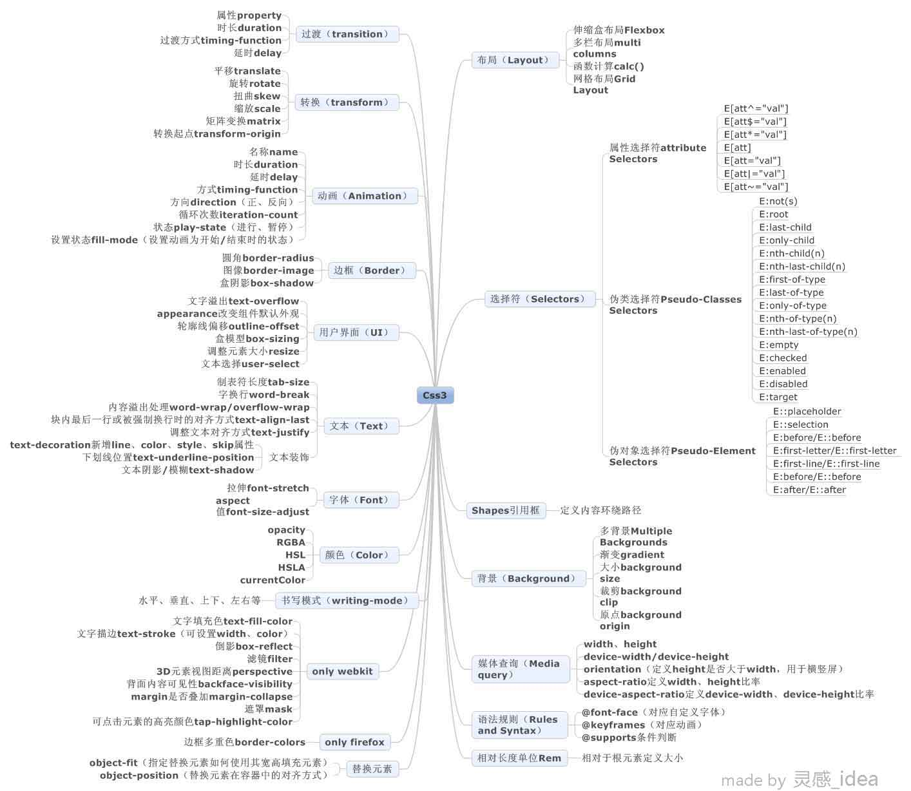
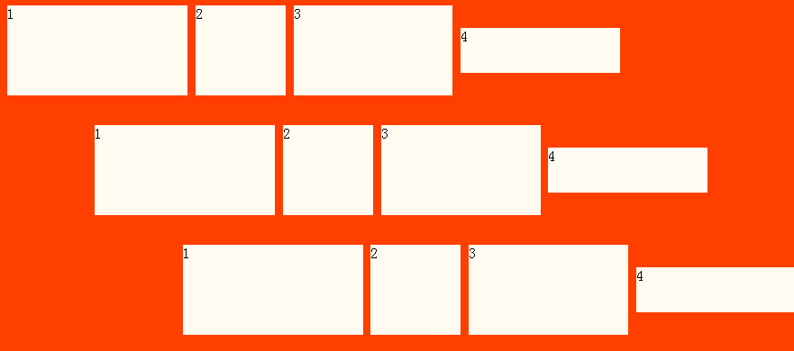

title: 图文浅谈css3          
date: 2015-03-14
tags: [CSS]
categories: [CSS]
toc: true
---

css3已经“出来”挺久了，由最初的新奇，尝试，到现在慢慢的被习以为常的应用，特别是移动端需求的暴增，对css3更好的支持，吸引更多的人走了进来，但是，对于刚开始接触它的人来说，或许会有很多的混沌之处，毕竟它是个大宝藏，而多数人因应用的局限，了解的面也相对局限。本文就试图给出一个稍大范围的概括性展现。当然，也只是一部分。

一谈起css3，多数人可能首先想到的是各种炫酷的效果。的确，css3的出现的确是使得css的世界有了焕然一新，被解放了的感觉。以前需要用图片的，需要多个标签进行堆叠的，需要用js的，需要用flash的等等，甚至是几乎想不到办法去做的东西，css3都给了我们相应的补偿。

但是，今天我不去从那些方面开始谈，我会按照某种分类把css3来个整体浏览。目的是让对css3不太了解的人能有个大概的了解，我自己也算是复习一下。另外，此文不会列出一堆代码给你看。

## 布局

Css最重要的一个作用，就是布局，而初学css3的朋友可能会因为种种原因忽视掉它，原因有二。

被各种酷炫的新“功能”给蒙蔽了，觉得那就是css3~
没觉得之前的css布局方法有什么不好，觉得够用了，不遇到新的问题或者没人提起，就不会去在意。人总是容易知足的~
灵活的Flexbox

小谈一下float，很多解析float的文章都提到float本身在设计之初并不是用来布局的，而是用于图文混排。而且浮动的元素会脱离正常的文档流，要闭合浮动。目前的很多网页都是滥用浮动，如之前的滥用div般，随处可见fl、fr，然后来个clearfix，万事大吉！这种现象已经被人批过很多次了。

## Flexbox能干嘛呢？

当你给父容器应用了display：flex；（注：flexbox在发展过程中有多个版本，此写法为最新版本） 那么它的子元素经过简单的相应设置可实现： 横/竖排

整体左中右（水平）、整体上中下（垂直）
倒序排列、任意顺序排列（在不改动html结构的情况下）
多余空间分配，元素超出处理。
子元素可单独设置自身的属性。 等等 如下

## 多栏布局Multi columns

顾名思义，就是多栏，它的灵活之处在于，可以随意设置栏数、栏宽、栏间隔、栏分割线等，同时你不需要用同样数目的容器去放内容，它会按照你所设置的那样乖乖的排布，一个用的最多的形容便是像报刊、杂志那样的排版方式。如下 

## Calc()

calc是英文单词calculate(计算)的缩写，可以使用calc()给元素的border、margin、pading、font-size和width等属性设置动态值。为何说是动态值呢?因为我们使用的表达式来得到的值。calc()最大的好处就是用在流体布局上，可以通过calc()计算得到元素的宽度。 为什么需要计算呢？有个问题大多数人应该都遇到过，那就是元素设置的有border、padding等，而且是具体的值，比如px或者em、rem等。但元素本身是不定宽，这个时候，那么还怎么去设置元素的宽？ calc()就是给我们开发者提供了方便，把问题交给了浏览器。 比如这样：width:calc(100% - (10px + 5px) * 2); 当然，你应该想到了，它能解决定宽不定宽并存的问题。

## Grid Layout（网格布局）

这种布局方式，跟flexbox有相似之处，也有人拿二者作比较，这段就简要介绍一下它。 乍一看，它会很像表格，但它不是由html所写出的表格，而是由css来进行设置。 它可以依赖于媒体查询根据不同的上下文重新定义布局，还可以让我们摆脱现在布局中存在的文档流限制，你的结构不需要根据设计稿从上往上布置了。这也意味着您可以自由地更改页面元素位置。

## 摆脱图片，代码来搞定

**阴影**

包括text-shadow、box-shadow

**圆角border-radius**

突破了以往只能是方形盒子，或者需要用多余标签和图片来制作圆角效果的情况。

**渐变gradient**

渐变在网页设计中随处可见，常用在背景上，以前遇到渐变，只能通过切图，哪怕是一张很小的图进行平铺。有了这个属性，提供了多一种用代码解决的方案。

## 给图片加上“翅膀”

**图像边框border-images**

以前，边框只能是有限的几种线性，想做出更丰富的效果是做不到的，但有了这个属性之后，你的创造力+合适的方式，便成创造出很好的效果。

**多背景图backgrounds**

在之前，一个元素同时添加两张背景图是做不到的，但有了这个属性，就解决了这个问题，你不仅可以添加多张图作为背景，还可以控制它们的位置。

**遮罩mask和滤镜filter**

这两个用过ps的都知道会是什么效果，但现在为止，浏览器对它们支持的不是很好，在网页上应用的也很少，就不多说了。

## 媒体查询 Media query

这个东西也是很多人开始接触css3就了解的东西，它算是一个亮点，给开发者提供了一个为不同设备应用不同样式的方式。特别在现在这种移动设备多种多样的情况下，更加的体现价值。

## 选择器

这是css3一大亮点，相比之下，以前的选择器显得很单调了，也直接导致了页面当中会出现很多为了效果而加的钩子，多了之后会进一步导致命名的困难，如果类和元素关联的比较密切，或者规划的不好，就会出现要嵌套很多层去增加权重，性能也随之降低等，所以，这是个系列问题。Css3新增的选择器则有了诸多筛选的标准，比如第几个，偶数、奇数个，否定，空元素，属性选择等等。

## 盒模型 Box-sizing

或许每个人都会犯过这样一个错误，给一个元素设置了宽度之后，再设置padding，呀？！怎么溢出了？这是为什么？就是盒模型在作怪。目前这些版本的浏览器默认设置的width是不包括padding的，你可以通过box-sizing来改变它。

## Rem

提供了一种相对于根元素定义大小或者长度的方式。

自定义字体 @font-face

这个规则同样是css3的亮点，每位做前端开发的人都碰到过这个问题——视觉稿里面的字体好好看，可自己的电脑上面没有那种字体，好，索性找设计师要那种字体然后装在自己的电脑上，可问题又来了，我自己能看到了，用户怎么办？@font-face为我们带了曙光。

## Css3的那些炫技

好吧，虽然这篇文章好像在故意的“避谈”这些东西，还是不得不谈~为什么避谈呢，在文章的第一段已经做了说明，就像是有一种行为总是被批一样——“哇，这个做得看起来很不错哦，html5做的吧？”其实可能一点html5的东西都没有用，只是用了css3或者js，同样，对于看到一些动画，就联想到css3，仿佛css3=动画的看法，也是错误的，css3的宝藏还有很多。

**Transform、translate、transition，傻傻分不清楚？**

这几个东西对于初学者来说还是可能会迷糊，当然，如果看了上面我提供的那张图应该不会了。

Tansform是用来控制几种形变或位置变化，比如rotate（旋转）、skew（扭曲）、scale（缩放）等，很多动画都离不开它。Translate（平移）也是其中一种。

Transition为对象的状态变化提供一个过渡的过程，而不是像以前一样突变。当然，它可以用来做动画效果。

**Animation**

一说到动画，以前都是结合着js或者Flash来做的，html5的canvas也不例外。但到了css3，引入了animation，再配合一些其他一些可以控制元素位置和形状以及外观的属性，就能做出动画来。

它还有许多有用的小东西，比如shapes，可以让你在图文混排时做出圆弧边缘或者各种不规则形状等等。

## css3给我们带来了什么？

至少从目前看来，某种程度上提高了制作某些效果的效率、提供了多一些方案、使代码的维护更加方便，性能也得到了提升。也让css的世界变得更加丰富多彩。

当然，一项技术能用好，光是知道这些东西远远不够，起码要做到几点：功能性、完整性、灵活性、实用性、合理性。若能做到这几点，那便是很高的境界，能够挥洒自如。

此文只是提供了一些粗线条的东西，虽然参考了一些资料，比如

[w3cplus](http://www.w3cplus.com/),[CSS手册](css.doyoe.com/),[webkitcss](ued.ctrip.com/webkitcss/)

但难免有不当之处，欢迎交流。
 
