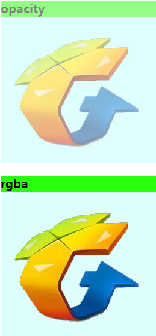

title: 小叙透明         
date: 2015-05-09
tags: [CSS]
categories: [CSS]
toc: true
---

网页的历史不长，但是几经变化，不论是从布局，文字，颜色搭配，图标等等，都是有过诸多的演变，人们的审美不同了，或者说，一直在追求更美观的效果。

拿一些细节方面来说，比如渐变，圆角，阴影，半透明，这几个应该是被用的最多，效果也很好的方法。其中前三个，都可以做到比较好的退化，甚至说牺牲，因为很多时候，即使它们在一些浏览器里有，另一些浏览器里没有，看起来也能让人接受，不会产生太大的影响，半透明就不同了，透明和不透明的差别还是蛮大的，那么今天就来聊聊“透明”。

透明还分为两种，**半透明的纯色** ，**背景透明的图片**。

## 背景透明的图片

大家都知道这个在IE6下会不支持，图片是有格式的，what格式会出问题？ 我们网页中常用格式jpg、png24/png8、gif，其中后面两者是透明的，而会出现问题的只是png24格式，见下图

应该看出来了，它不仅仅是背景不透明还会出现比较明显的锯齿。 其实说到这里，想到一个问题，还管IE6干嘛。。。不过真有一部分需求是要管的，所以， 如果还有兴趣做了解的话，那么大家可以看看这篇文章 [使IE6下PNG背景透明的七种方法任你选](http://blog.csdn.net/mosliang/article/details/6760028)

那图片就不用多谈了（好懒呐~）

## 半透明背景色

Css的什么属性可以做到这点呢？

Opacity：0~1，取值为小数（常见1位小数，多位亦可）。纯控制透明度，适用IE9及以上浏览器和其他主流浏览器。

filter（IE私有属性），写法filter:alpha(opacity=50); 适用IE8及以下浏览器，产生类opacity效果。

Rgba：控制背景色和透明度，适用IE9及以上浏览器和其他主流浏览器。

低版本IE使用滤镜，例如： filter:progid:DXImageTransform.Microsoft.Gradient(startColorStr=#80000000,endColorStr=#80000000);

其中参数值是 #AARRGGBB 形式的，AA是代表不透明度的十六进制，00表示完全透明，FF就是全不透明，化成十进制的范围就是0~255，剩下的 RRGGBB 就是颜色的十六进制代码。

其实我在想怎么不能有一个东西搞定所有？事实证明这是有难度的，技术在发展，标准在行进，厂商支持也不同。

## 哪里会有问题呢？

不少需求里面都会需要用背景透明，那么该怎样去选择这些透明来为自己服务呢？

现在做技术的同行有些是“实用主义”，不管方法是怎样，可以达到目的就行；有些是“能用主义”，只要找到一种方法行，就用了。这两种情况一般都不会去深究，只看效果，通常遇到这样的问题的路径就是想起“opacity”一用，好像不对，一下都变得朦胧了，比如这样

然后查查还有什么比较好的解决方案，找到了rgba，一用果然不亦乐乎，

再一看，浏览器支持貌似不好啊！连IE8都挂了。

## 那到底该怎么办！

其实上面已经给出办法了不是么，只是需要说的是二者的不同使用场景，

opacity是用来控制透明度，注意，前面没有“背景”二字，所以，它以及它的子元素都会受到影响。那么这种就适合做啥呢？对了，ps中的蒙板效果。你还会嫌弃它使内容也透明吗？别的想做还难呢，正所谓，各司其职~

有些人应用opactiy，多加了一层在外面当做“背景”，然后使用定位把不想透明的内容叠放在上面，此法实为下策。

rgba是在rgb色值的基础上，加了alpha通道的透明度，所以，它控制的是背景色。

那要使得背景透明，内容不透明，该怎么做呢？

**rgba+IE滤镜**

只是有几点需要注意：

1.IE6、7不认识alpha，需要激活IE的haslayout属性(如：*zoom:1或者*overflow:hidden)，让它读懂filter:Alpha；

2.滤镜能够支持到IE9，那么IE9到底该听谁的？会重复的起作用？是的，所以，还是需要区分开来，即使是平时写浏览器兼容的时候也是最好做个区分，不要让那些代码在所有浏览器里都加载，虽然它们起不了什么作用。

3、在父元素position：static;子元素position：relative;的情况下子元素才不会受影响，否则其仍将变成了透明的。

代码如下：

    css:
    .solve{
      background-color:  rgb(190, 255, 252);
      filter: alpha(opacity=20);
      background: rgba(190, 255, 252,0.5);
      *zoom:1;
       }
     .solve h2,.solve img{
      position: relative;
       }
    html:
    

    <h2>解决方案</h2>
    
    

对比效果

没做特殊设置的下场

需要指出的是，rgba（）它是用来定义色值的，也就是说，它不专属于背景，比如我们偶尔也会碰到透明的边框等等，也是同样适用的，除了在个别浏览器下可能支持会有小的差异。

还有一种不常用的HSLA，它和rgba异曲同工，比如background:hsla(165, 35%, 50%, 0.2);这样，设置颜色和透明度。 具体如下：

使用色调Hue(H)、饱和度Saturation(s)和亮度Lightness(L)来设置颜色。

Hue衍生于色盘：0和360是红色，接近120的是绿色，240是蓝色。

Saturation值是一个百分比：0%是灰度，100%饱和度最高。

Lightness值也是一个百分比：0%是最暗，50%均值，100%最亮。

好了，这次聊的不多，不过还是希望能够帮到一部分朋友。问题多多，来日方长，咱下次见呗！~

推荐文章：[css实现背景透明文字不透明](http://www.cnblogs.com/PeunZhang/p/4089894.html)

欢迎关注微信公众号：css3china 前端周末

QQ：152128548