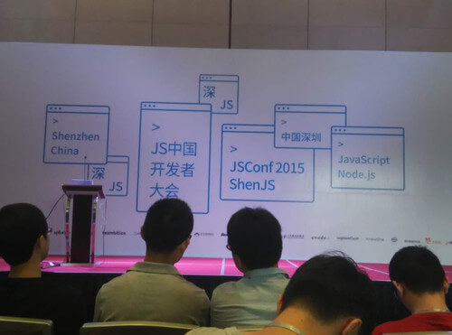
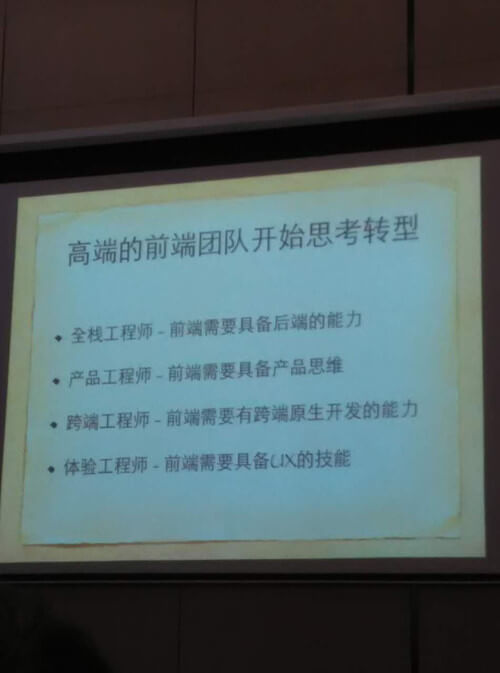
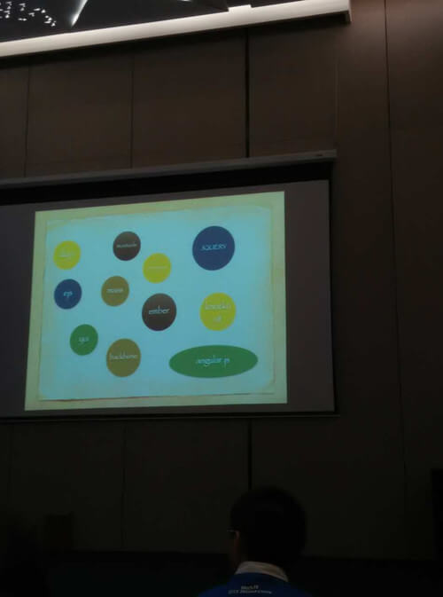
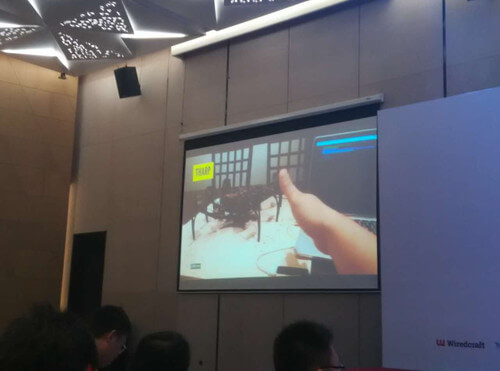

title: 我的“深jsconf2015”之旅         
date: 2015-05-09
tags: [分享交流]
categories: [分享交流]
toc: true
---

说实话，我似乎没有理由来这一届深js，首先我不擅长，然后我的职位是重构，工作当中用的也不多，在过去的两年里基本上主要精力都在html和css上。由于种种原因，虽然买了不少js的好资料，也断断续续的在学习，但依然没有任何能拿得出手的东西。也就稍微会点jq之类，所以，在高手云集、群星璀璨的jsconf上，客观上来讲似乎不能get到多少精华的东西。还有一点更现实的问题是，花了500银两，是疯了么？好吧，接下来说说理由和感想。

理由一：在深圳，这次大会有来自全国各地，乃至世界各地的人们，当有很多人背着包，拉着行李箱，在去往机场或者车站的路上的时候，我已经到了家，所以，没理由不来。

理由二：两年前决定从事前端，却一直没能成为一名真正的前端，而是只会写写页面，一点简单交互和动效的伪前端，虽然如此，依然在努力学习着以弥补自身的不足，就我个人的经验而言，你可能在自己成长过程中，遇到各种突如其来的困难和考验，每一次都能让你找到自身的不足，都能有所进步，而这些困难和考验有些是无法准备，也是无需准备的，正如这次大会，虽然我不具备完全理解大牛们所讲的东西的能力，但如果它能给我带来启发，让我能够站在更高层次上去认识它，或者帮助我拓宽视野，就值得，事实上，它给我的，远远比我想象的多很多，让我觉得特别的值。所以，来对了

都有什么感触呢？

1、首先要承认的是，使用全英文的外国友人以及尤小右所讲的内容，我几乎完全没有get到，曾经考过英语6级的我来说也是“然并卵”，所以，这让我有了更强的紧迫感去加强自己的英文，虽然我每天也并不需要跟外国人交流，但仍有很多的英文资源是可以学习的。而且在将来，谁又敢说不同外国人交流合作呢？到那时候再努力，晚矣

2、虽然如此，我仍然努力的去跟随着演讲者的稿子和它所敲的代码，去观察和体会，两天21位讲师，加上几波的lighting talk让现场的数位观众有机会上台做短分享（他们也都是各大公司的技术能人哦~），信息量真的超级大，超级丰富，所以，有人说，这种大会就是各种大神聚在一起聊聊天，吹吹水，叙叙旧，no！

3、视野和想象力的局限性，很多东西我们看不到，就觉得它可能还没有，不存在，很多东西我们没做过，就认为它做不到。这样的大会就是给了我们一次机会去看看，有些东西其实是存在的，其实是可以做到的，就是让我们意识到自身目光的局限性。比如说，至今还有人认为js就是用来做网页上面那些动效的，有了node之后，认为他可以做服务端，但是它还可以作用于硬件。

4、我一直在思考的一件事情，为什么我没能很好的掌握js，实践的少这是其一，其二就是，它跟css在使用和方法论上面的差异，或许这也是一些人说的所谓“程序语言”和“非程序语言”的差异，我们写代码是用来实现一些需求的，把需求转换成我们所用的技术所能做的事情，抽象成某种模型之后，才是技术实现，所以，这就是中间所隔着的那座山。再举个更加易懂的例子，当给你一个网页，第一眼看上去，csser和jser所看所想肯定有很大不同，一个注重表现、布局，一个注重行为、数据，然后再顺着两种技术的不同路线接着往下走，这就是我说的区别所在。
通过这届大会两天的熏陶，我似乎在“远离”着css的工作方式和逻辑，在强迫着自己去适应js的世界，总得来说效果还不错。

5、现场来了很多牛人，尤雨溪、贺师俊、徐飞，还有各大公司的骨干，还有一些外国大牛等等等等，恕我不能一一列举出来，你不仅能够见识到它们所分享的技术方案，也能见识到他们现场coding的风采。

6、不得不提的是，现场来了很多大学生，甚至来了一位高中生，而且当时就坐在我前面，我真是惊呆了，这不得不让我这个已经出来工作还为500块犹豫的人感到惭愧。更意外的是，他可不只是来凑热闹的，他知道很多东西，也用过很多东西，好吧，或许这不能“怪”他太强，而是我太弱。在这里你不仅能够感受到年轻人的学习热情，还有一些从业十几年的人那种在谈论技术时候的激情，吃饭的时候，坐下闲聊的时候，甚至有些结束之后另外约别的地方聊到很晚。可能知音难觅吧，所以有人说github是世界上最大的同性交友平台，很多人在上面相互f**k~
 

好吧，最后来点小结，会场有很多公司赞助的那啥和那啥我没拿，有打折卖的书，忍住了没买，前面也说了我已经买过很多，不过…这次大会抽了四次奖，抽了那么多人，我居然没有中，就我今年的运气来说，这很不科学，最后有三十本书让人随便拿，然后，还没等一等奖的人领完奖，身边就有人冲了出去，我…也冲了出去，抢到一本，哈哈！

有一点遗憾就是，还没来得及跟情封和鬼懿合张影留个念，他们就提前半天走了。（看来是嫌我红包给得少，哈哈~）

和很多人一样，这次大会多少会有一点“见到很多大牛”真身的一种满足感，但是，还没有见到我想见的全部的人，再加上这次大会的精彩程度和满满的收获，让我对下个月在“魔都”上海举办的第二届cssconf更加充满了期待，所讲的主题全都是我感兴趣的哦！你呢？约吗？~~

最后送几张图

这位就是全场唯一的高中生

