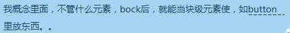
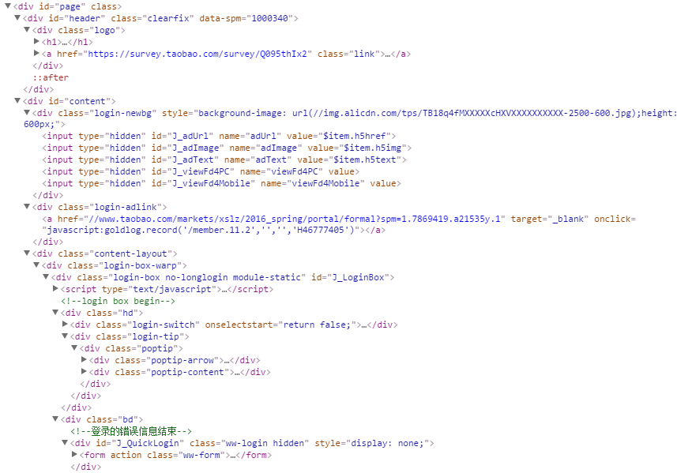

title: 是时候再提web标准       
date: 2016-04-09
tags: [总结]
categories: [总结]
toc: true
---

## 背景

web标准是个老生常谈的话题。引入国内的时间，粗略算下来，有十年左右了。但是由于国内前端优秀人才的缺失和相关教育跟进的缓慢，造成了很多人都没有对它引起足够的重视并运用到自己的实际项目当中，同时又花了较多精力在眼花缭乱的新技术方案和工具中，这就造成了技术断层，影响不是一个两个人，而是一大部分，如果再缺少相关的正确引导，就会保留很多不正确的编码习惯，对于个人成长和所做的项目都是不利的。

为什么是时候再提呢？可以先来看看下面一张具有一定代表性的图，截自我的企鹅群（152128548）

1、标签仍在被滥用
2、重视觉，轻语义和结构
3、热衷于跟进热门新技术，不重视基础
4、当我在跟大家说重视基础的时候，要么有人说原生js，要么有人说css原理和技巧，没人说html

由于以上的几点，加上各种场合和会议似乎很少提及这些方面的东西，新手在被老手“牵”着走，老手的精力又不在这些比较基础的东西上。这篇文呢，就是跟大家一起回到起点，去看看怎样做才算是符合了web标准的编码。

## 问题来源

### 1、门槛低、简单

**一周就可以掌握html，常用标签不多，用不到的不用管**

比如：h1~6、p、span、div、img、a、input等，我们来随意的看一张截图

上面是某宝PC端的登录页，可能是由于种种原因（不详），只用了少量的标签，所以，并不说它是不好的或者是错的，但它是其他很多人的写照。如果我说html标签有100多个，你会是什么反应？

1、不知道，没想到有这么多
2、知道，但认为很多都用不上

你会是哪种？

如何在合适的时候，合适的地方，使用正确的标签，这是web标准的基本要求。后面细说。

**CSS很简单，常用属性也就那么多**

宽、高、边框、背景、定位、浮动、边距，如果你掌握了这么多，那么就能够应对很多页面布局的情况了。如果你因此就认为css很简单，那么就等着它来“惩罚”你吧。

不好的方面：各种兼容问题，各种奇葩布局要求，各种不可预知的bug

好的方面：诸多奇妙的技巧和css3新属性，能够帮助我们做出充满美感又神奇的效果

如果你依然觉得CSS太简单，那么请看一下这里https://drafts.csswg.org/indexes/，要坚强~

### 2、只需要做“对”，不需要做好

很多时候，即使写错了浏览器会包容它，当我们的代码是不规范的，甚至有时候是错的，但是浏览器仍然将它“正常”显示出来，这个时候，我们意识不到自己的错误。认为看起来没问题就没问题，这是很危险的。

标签不用在意，交给CSS去处理就好，理论上，我们可以通过一定的CSS规则，任意的改变一个元素的表现，这就造成了对html标签的不重视，因为我们总能让它们看起来没有任何问题。

### 3、热衷于“向前看”

学习新技术，丰富自己的技能树——html5、canvas、svg、react、ES6等。

解决“难题”——觉得一般的工作没什么挑战了，所以不屑于去深挖自己已经会了东西。

做出炫酷的效果——纯CSS图标、动画，3D动画，canvas动画等。

跟风式学习——大家都在谈，业界都在捧，看起来很好的东西，就开始躁动不安，跃跃欲试，其实有句话叫做：“基础不牢，地动山摇”，兴致冲冲的去学习新的东西的时候，往往会发现，没有足够的基础，是很难前行的。

上面说的这些是错的么？当然都对，特别是在技术发展更新迭代速度快的互联网领域，想会得更多让自己更强，同时会的更多在实际应用中可选择的方案也更多，兴趣驱动去学习，这是好事，我自己也是这样的，但我们需要注意的是，学习不是一条直线，不能沿着一条线一直往前冲，除了长度，还有深度，需要我们不断的从各个方面去打磨和填充才能日臻完善。

## 文档结构和意义为先

我们都知道，实现一种效果可以有多种方式，那么哪种才是最优的？来看例子

### 列表

什么特点呢？最明显的就是有很多项，项和项之间相互独立，竖着排列，像这样

我是列表
我是列表
我是列表

它可以被怎样写呢？

1、  

      我是列表 
         我是列表 
         我是列表 

2、

    <li>我是列表</li>
        <li>我是列表</li>
        <li>我是列表</li>

3、

    <ul>
        <li>我是列表</li>
        <li>我是列表</li>
        <li>我是列表</li>
        </ul>

上面三种是比较直接想到的对的写法，当然也可以用ol，算同一种方法。它们所能实现的效果是类似的，往往我们会从表现的角度考虑说第一种不够灵活，无法控制样式，第二种方法浏览器也不会不搭理你，它会把li解析成块级元素，让它们单独排列，但它失去了告诉浏览器“我是个列表”的标志，也就是外层容器（ul/ol），最好的写法肯定是第三种，它不仅看上去是对的，还告诉浏览器这是个列表，还有列表所应有的特点，比如“缩进”和“着重号”，当然，最大的益处仍然是它是有意义的，也是为什么这里没有提div和p等元素的原因。

### 标题

作为标题，特点也简单，比页面上其他的文本更大、更粗。
我们可以这样写：

1、	

    我是标题

2、	

    
<b>我是标题</b>

3、 	

    <h1>我是标题</h1>

不看代码的情况下，三者可以一模一样，但看了代码的话，大家应该都会第三种写法是最好的，第三种写法的好处有哪些？

1、本身是块级元素
2、是独特的，不像p或者span等元素会用到页面当中的很多地方
3、更加重要的是，在不加任何css规则的情况下，标题元素仍然明显是个标题，页面的无样式视图将显示其预期的文档结构，正确的标题元素传递了“意义”而不只是表现指令
4、屏幕阅读器、手机和其他浏览器也将知道如何处理标题元素
5、搜索引擎友好，除了title和meta，标题是最可能存在关键字的地方，利用好它，会更加方便用户找到你的页面

但是它有没有问题困扰着我们呢，答案是有，h1和h2这些标题的默认样式被认为过于粗大，这会让有些人倾向于使用更高级别的标题元素，其实这个大家都知道，不是大问题，可以用css来控制，前提是：先结构，后表现。至于选择使用h几，也不是没有讲究的，它们既然是分了级别，那自然是有一定意义所在，一般来说，h1是个重要的标识，页面当中有一个就好，然后，不要出现类似h2包裹h1的情况。

### 表格

现在如果提到表格（table），很多人会觉得好笑，使用web标准构建网站的一个最荒诞的说法就是你应该永远不使用表格。

是的，使用table来布局确实是有劣势，但并不代表我们不能用表格来做适合它做的事，比如：数据化表格。

最简单的表格可以有下面这个结构：

    <table>
        <tr><td></td><td></td></tr>
        <tr><td></td><td></td></tr>
        <tr><td></td><td></td></tr>
        </table>

有时候，我们会在表格的上方加一点说明性文字，通常我们会习惯性的使用h*或者p标签来包裹这一段内容，如果你是用div，那么...

其实我们有更好的选择——`<caption>`，这个是表格自己的专有标题哦，有它为什么我们还要用别的呢？

除此之外，如果我们想给表格的第一行算作表头，可以怎么做呢？可以这样：

    <tr><th></th><th></th><th></th></tr>

把这行代码放在第一行，th标签会给它不同于td的样式来区分出和其他行的不同，此外它可以是行的，也可以是列的，怎么区分呢？还有这个——scope属性scope=row/col，把此属性添加到th标签中即可设置它的归属。

但这样就够了吗，如果对于简单的表格来说已经挺好，那么好像它还没有比较清晰的逻辑结构，那么，不卖关子了。较完整的表格，应该是下面这样：

    <table summary="这是一个表格的内容简介" cellspacing="0"> 
        <caption>表格标题</caption> 
            <thead> 
                <tr> <th scope="col" id="name">姓名</th> <th scope="col" id="address">地址</th> <th scope="col" id="databirthday">出生日期</th> 
                </tr> 
            </thead> 
            <tbody> 
                <tr> <td>ewee<td> <td>hubei<td> <td>19870102<td> 
                </tr> 
                <tr> <td>rewe<td> <td>wuhan<td> <td>419880103<td> 
                </tr> 
                <tr> <td>ertww<td> <td>yichang<td> <td>19870205<td> 
                </tr> 
        <tbody> 
        <tfoot><tr><td>one</td><td>two</td><td>three</td></tr></tfoot>
    </table> 

是不是顿觉十分的清晰，慢着，summary="这是一个表格的内容简介"这句是什么鬼？好吧，看内容便知，它是关于表格的一个简介，这个简介用户是看不到的，屏幕阅读器可以利用该属性。

### `<strong>`，`<em>`，`<b>`，`<i>`和其他短语元素

 短语元素，在于控制的颗粒更小，无关布局，和表现也没有太大关系（虽然它会有加粗或者倾斜的效果），用来对于页面中的某些特殊内容做出特别的标识，比如“强调”、“引用”等。

那么它们的区别在哪儿？

`<strong>`代替`<b>`,`<em>`代替`<i>`

传达意义和结构，而不是给出表现指令。

`<em>`表示强调，`<strong>`表示更加强调，在语音合成器用户代理场景下，它们还表现为音量、音调及语速的区别。如果一个元素需要既强调又斜体，那么我们可以选择正确的标签，然后通过样式来控制其他方面。

如此之外还有其他短语元素，比如:

`<cite>`     包含对其他来源的引言或引用
`<code>`   指定一个计算机代码片段
`<var>`     表示一个变量或者程序参数实例
等

### 最小化标示

通常情况下，较少的代码意味着更快的下载，还意味着更少的服务器空间和带宽消耗。有个问题就是，即使你写出了符合web标准的页面仍然不能说明你写出了足够简洁或者合理的代码。正所谓规则是死的，容易做到，碰到实际场景，不同的做法会导致结果不同。在我们成长过程中，会遇到不同的老师，要么是一篇文章，要么是一本书，要么是具体的某个人，追溯到最后仍然是人，不同的人，观点和习惯可能不同。比如，你可能会养成一个习惯就是希望给所有单独添加样式的元素分配一个类，这样做到了较强的可控性，但是，这样引发什么潜在的问题呢？

1、过多的类
2、类的命名难

除了上面两点，还有一个可能碰到的就是类名重复，然后样式冲突。

可能上面的问题你都遇到过，或许也想了办法去命名，去避免冲突，但有没有想过前因后果的关系？我们常常会“遇到问题”——“解决问题”，其实我们是在“制造问题”——“解决问题”。从现实情况看，也没有多少人在尝试的去打破它。

我认为，为什么要命名那么多的类，因为我们可以通过给予不同的类名去区别开来元素样式，即使有个类名叫info，我们可以起个a-info、b-info，那么它们俩就是不同的了，我们还可以.a.info、.b.info，同样能够对其进行区分，再向上追溯，我们为什么要使用类名来区分它们？最大的可能就是，我们在同一个父容器里，使用了较多同类型的子元素或者后代元素，这又是为什么呢？是不是回到了我们最初对于html标签的看法上——常用的标签不多？事实上，我们经常不加思索的使用div、p、span，一个用作大的包含块，一个用作包裹整段文字，span用来包裹行内文字，顶多再加上img、a、i等。我说的是不是很简单（然而这样还是会有人用错）。那么实际上有这么简单吗？正是因为“重视觉，轻语义”，至于我们能想起来使用的正确的，有意义的标签很少，觉得没有必要锱铢必较，那么网页中那么多的内容，难免会出现我们所说的那几个元素的重复，重复了怎么办？样式不同啊，加类，类多了怎么办？想办法区分类，于是，就是你所熟悉的那些行业问题了。

或许你会说，在大的、复杂项目里面，这些都是不可避免的，好，我同意你的说法，那如果我们能在结构和意义上做得更好，是不是能把这种情况大大改善？

其实我们的CSS选择器足够而且正在变得更加强大，我们完全没必要把希望都寄托在加类这个看起来很省劲的方法上

譬如：后代选择器、子选择器、各种伪类选择器、兄弟选择器、属性选择器等。

小结：任何做法都不要非白即黑，不偷懒，不含糊，把方法合理巧妙的结合起来才是正道！

### 多种场景的样式

在日常项目中，我们很少会碰到特殊的需要，一般只要这样一行代码就够了

    <link href="" rel="stylesheet" type="text/css">

那么如果有特殊需要，该怎么做？可以看下下面这个表格

值	       描述
screen	     计算机屏幕（默认）。
tty	         电传打字机以及类似的使用等宽字符网格的媒介。
tv	         电视机类型设备（低分辨率、有限的滚屏能力）。
projection	 放映机。
handheld	   手持设备（小屏幕、有限带宽）。
print	      打印预览模式/打印页面。
braille	      盲人点字法反馈设备。
aural	      语音合成器。
all	          适用于所有设备。

找到它并不难，难的是，很多人可能不知从何处着手，没有这个意识或者概念的话，也就不会去查。了解了这些，就能根据不同场景给我们的页面分配不同的样式规则。

### html5来了

必须承认一点，当我最初看到html5的时候，内心是激动的，在它出现之前，是没有足够用来表示页面结构的语义化标签供我们使用的，一般我们是用“类”或者“id”来定义它们。不过同时问题又来了，应该怎样正确的使用它们？正如以前我们面对旧版本的html时忽略了很多语义化的标签一样，如果我们不能对这些新增加的标签有正确的认识，那么我们同样会陷入泥淖，虽然看起来会比之前好些。
较常用的有以下这些，你已经用起来了吗？

`<article>`     
定义外部的内容（结构元素）

`<aside>`   
定义页面内容之外的内容。 aside的内容与article的内容相关。（结构元素）

`<figure>`  
定义一组媒介内容的分组，以及它们的标题。（结构元素）

`<section>`         
标签定义文档中的节（section，区段）。比如章节，页眉，页脚或文档中的其他部分（结构元素）

`<time>`    
定义一个日期/时间	（内联元素）

`<audio>`   
定义声音内容。(内嵌元素)

`<video>`   
定义视频。(内嵌元素)

`<canvas>`      
定义图形,绘制路径，矩形，圆形，字符以及添加图像的方法

`<dialog>`      
定义对话（会话）dialog元素表示几个人之间的对话。HTML5dt元素可以表示讲话者，HTML5dd元素可以表示讲话内容。（结构元素）

`<embed>`       
定义外部交互内容或插件 

`<footer>`      
定义 section 或 page 的页脚

`<figcaption>`      
定义 figure 元素的标题

`<hgroup>`          
用于对网页或区段（section）的标题进行组合，对网页或区段的标题进行组合

`<header>`      
定义 section 或 page 的页眉（介绍信息）

`<mark>`        
定义带有记号的文本，请在需要突出显示文本时使用 <m> 标签

`<nav>`     
定义导航链接

`<source>`      
定义媒体资源

更多标签可以参照这张图 http://www.inmotionhosting.com/img/infographics/html5_cheat_sheet_tags.png

或者到这里查看更多http://www.htmldog.com/guides/html/

## 需要注意的几点

### 结构和表现分离了吗？

从我们开始接触分离观，可能就有一种认识，html里面不要有内联或者内嵌的样式，就是分离了，其实不然。
这带来了一个后果，不重视标签和类依赖。所以，貌似我们已经完全做到了分离，但分离之后，结构并没有做好它的本职工作，然后可能引起我们不得不要用类加以区分，反而因为要照顾到样式，在结构和表现之间建立很多纷繁复杂的联系，这也是带来维护问题的根源之一。不要所有事情都交给CSS解决，让CSS只做它该做的，也不要让自己在标签上使用的失误成为见缝插针的理由。

### div无罪，table无毒

十几年前，当css出现并且普及，人们就开始了对以往页面的重构，很多使用table布局的页面被重新编写，用什么呢？“div+css”，相信大家都见过此类的教程或者书籍，笔者最初看到它的时候，就认为div是一门技术，因为它们是并列的关系，现在大家都知道，明显不是，但它所带来的影响是巨大的，div开始在页面中频繁出现甚至到泛滥的地步，然后，一批比较早觉醒的人以及html5概念的出现，让人们重新开始重视语义化，对div的态度开始了转变，仿佛用了它就是错误。其实不管是滥用还是不用，都是一种极端的做法，我们应该理性看待技术，它们的产生都是有原因的，也都是有自己的应用场景的，除非它们被更好、更合理的东西所替代（比如html5中所废弃的标签）。否则就应该占有一席之地，不该被区别看待。

table也是同样，实践证明它不宜用来大范围的复杂布局，但是还是有它的应用场景的，上面表格的部分已做了描述，这里就不多说了。

### class还是id？

关于这点，可以参考一下知乎上这个问题的答案。https://www.zhihu.com/question/19550864/answer/23440690

稍微总结下关注点：

1、id唯一性，class重复。根据目标元素的重复性和独特性来定
2、id权重较高
3、外围用id，内部结构善用class
4、前端使用id操作DOM，重构使用class操作DOM，UI和交互相互独立互不影响

另外还提出一点对于class的误用，下面是W3C的描述：

class：There are no additional restrictions on the tokens authors can use in the class attribute, but authors are encouraged to use values that describe the nature of the content, rather than values that describe the desired presentation of the content.

意思是：class应该是描述内容的本质(语义)的而不是内容长什么样。

如果按照这种说法，那么有很多做法都是不妥的，相信大家看过很多“.f12、.fl 、.mr10”之类。

### 克服代码洁癖，html标签并不是越少越好！

代码终究还是要交给浏览器或者是屏幕阅读器去读，而不是人，所以，如果我们只是做到了让人看着是清爽的，舒服的，就跑偏了，当然，这里不是为某些不必要的标签和嵌套找正当理由，而是站在结构和语义的角度，去运用应有的，有意义的标签，标识网页中需要点缀的内容，告诉浏览器它们是什么。而不仅是站在视觉角度考虑需不需要。

## 全面了解，权衡利弊，方可取舍

作为前端，实现一种结构或者一种功能，往往有很多方案可以用，比如上面所列的html结构，还有我们常用到的布局方案，CSS效果实现，js的方法，逻辑实现，我们常提到的框架或者库的选择等

合理性——语义化、结构、逻辑、交互等
成本——学习、合作、迭代、维护等
兼容——多版本浏览器，多终端等
性能——传输、解析、查询等

举个栗子，如果你想做动画，怎么做？

flash、css3、js、svg、canvas、Gif等

只有当我们对每一种实现方法或方案都熟悉了，知道了它的优缺点和应用场景，才能取舍自如，否则就是捆绑住了自己的手脚。

## 学习资源的选择、标准的衡量

学习资源很重要，是否全面？是否正确？这决定了你对一项技术或者一个知识点的最初印象，一旦跑偏不知要多久才纠正得回来，更何况这种代价很多时候是没必要的。

这是我在知乎上看到的两个问题可以作为参考
“若想学 HTML，应从哪里入手？”https://www.zhihu.com/question/19753196
前端开发基础扎实的标准是什么？ https://www.zhihu.com/question/38922374

大家可以看看哪些是和自己的情况相吻合，它们就真的是很权威很可靠的选择吗？比如：http://w3school.com.cn/， 很多初学者的最爱，而且冲着这域名，也会认为它是跟w3c组织相关的权威的官方网站，实则它和w3c组织半点关系都没有，当然也并不是说它有多差，很多人因之受益，但是这是一种性质上的认知错误，实际上它里面的有些内容也是错误的。

再者说标准，不同人眼里的标准也是不同的，能写出页面是标准吗？能正确运用所有标签是标准吗？能熟练运用各种布局是标准吗？都不是，我们一直在进行一个“点——线——面——体”的过程，不论是单项技术，还是经验，综合能力，我们都在不断的积累和填充，单个点和单个方向做得比较好，不代表你就处在一个高的水平面上，或许在另一个地方你还缺了一大块，所以，不断摸索、探索，不断努力就好。

## 被遗忘的角落——无障碍设计

开发人员使用HTML、CSS和JavaScript创建富互联网应用程序时，往往把残疾人士抛在脑后，因为我们自己大多数是身体健全的人，所以，往往忽略了另一部分困难人士对产品的使用和需要。其实我们可以扭转这种局面。WAI-ARIA能够提供足够的语义，以确保富互联网应用是可以理解的，并且现在已经得到相对较好的支持。

WAI-ARIA是一个为残疾人士等提供无障碍访问动态、可交互Web内容的技术规范。主要是为了提升网页的可用性，网页对残疾人士的无障碍化，是对 HTML 语义化的补充。它具备比现有的 HTML 元素和属性更完善的表达能力，并让你页面中元素的关系和含义更明确。

如何使用WAI-ARIA？

应用于HTML的ARIA有两部分组成：**role**（角色）和带**aria-**前缀的属性，其作用：

role(角色)标识了一个元素的作用
aria-属性描述了与之有关的事物（特征）及其是什么样的（状态）

ARIA在HTML中使用有其自己的规范，并不是说在HTML中使用了ARIA，Web页面就无障碍化了，就提高了可访问性了。言外之意，ARIA没有用好，反而会把你带到另一个坑中，使用你的页面可访问性更差。

更多关于ARIA的使用，是一个大话题，不是一两句能够说得清楚，有兴趣多了解的，可以参考一下这篇文http://www.w3cplus.com/wai-aria/wai-aria.html

## web标准之外

**当量变引起质变**

1、维护性

举个栗子，如果我们去办事，两三个人时可以随便站，10个人可能就要排队了，如果有更多的人就需要有人维持秩序，再上升一个量级，可能还要分批放人，不然场面会失控。

页面是同样道理，一两个页面，几十上百行代码，那就不用太在意怎么写，不同方法带来的差异是可以忽略不计的。几十个页面呢？上千行代码呢？

2、性能

性能至少关乎两个方面，代码的执行效率和文件大小。一个决定了代码的解析和执行速度，一个决定了传输速度。这里不细说。

3、兼容

从当初的浏览器大战，后来比较坑的IE低版本，到现在的各种分辨率移动设备和各种安卓、ios版本浏览器的兼容，微信内核浏览器的兼容，等等。我们过去在做这样的事，将来也会。

上面说了，做出了符合标准的web页面，不代表我们就万事大吉，还有其他很多的实际问题会在量变到一定程度的情况下给我们制造麻烦，形成质变。那我们将如何应对这些质变？本文不做详述，只作为一个引子，后续会再写一篇文章来和大家探讨“web应变之道”。

下次见！~

