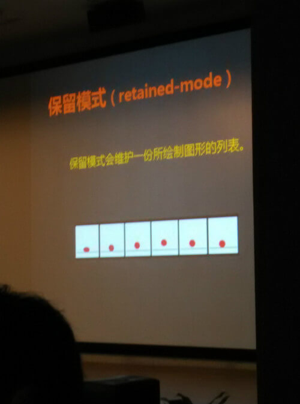

title: 第八届webrebuild年会总结暨“如何做一个理想主义者”          
date: 2014-12-27
tags: [分享交流]
categories: [分享交流]
toc: true
---

今天参加了webrebuild年会，一个多月没有写过文章了，之前是换工作，换完工作适应新的环境，接受新的任务，其实很想按照当初的想法，每周更新一篇来给自己作总结，做知识分享，可是，最近一个多月来有一种奇怪的感觉。每天还是像以前一样查资料，看书等等，却没有感觉到一点新的进步，一来二去仿佛进入了一个圈子，或许这是所谓的“瓶颈”吧，不光是技术上，还有心理。

这次webrebuild年会的主题是“初心”，那我为什么加上了后面的“如何做一个理想主义者”呢，其实是想写一篇文章总结一下这次年会，也总结一下自己。
 
## 一、开篇

当然是彪叔~大概也就他能hold住这样一个主题的开篇，谈到的话题也是涉及思想，心态，追求方面的东西。

 

初学者的心，最初的工匠之心。重构从“对设计稿的还原”，上升到“设计理念的还原”。

说实话，虽然我职业经历不长，但也已经在时刻提醒着自己，保持初心，因为人难免在生活、工作、社会、家庭等等诸多事务的浪潮之中迷失，妥协等等，渐渐的，时间过去了，青春过去了，整天也忙忙碌碌，可是能不能收获到我们当初想要的东西呢？我的QQ签名里也是写有“保持一颗纯粹的心”，就是为了提醒自己，不要因为生活，人情世故等等，扰乱了自己的心绪，改变了自己的初衷和前进方向。当然，这也只能是美好的愿望，因为生活是丰富的，你明天需要做什么或许自己也不知道，我们唯独能够把握的是大方向不变，心里那股劲儿一直在。

这个话题除了引发我对“初心”的思考，另一个就是“工匠“精神，彪叔举了他自己和公司的一些例子，很生动形象，也给了我很大触动，提醒了我们平时在工作的时候，眼光不要太局限，我们要做的事情很多，需要我们会做的东西很多，but谁都不是什么都通，做什么就一定会成功，但宝贵的是探索、实践的这么一个过程，尝试就有收获，就有可能。

## 二、十年（贺彬）

由来自腾讯互娱的前辈，讲述了一下他的十年，内容记得不是很清楚了，因为每个人的十年都不是简简单单，特别是这种对自己人生，工作经历的讲述，更是可能丰富多彩，伴随着很多的故事。其实每次听到台上的嘉宾在讲说，哪一年做了什么，哪一年来到腾讯，我也同时在想那年我在干嘛，在读初中、高中？互联网的历史不长，在中国的历史更短，也就十几年时间，但就是这十几年彻底改变了人们的生活，还记得当时上电脑课，我们就是去玩儿，玩儿的最多的无非是扑克，扫雷这些，而我当时见到电脑的机会很少，键盘上的按键什么的还认不全，就喜欢打字，那时候比较时兴”智能ABC“、五笔等等，曾经背过几次五笔的字根，背一次没学会，也没电脑，过个一两年忘了，又有老师教，又背，又忘，每次都是滚瓜烂熟的，但每次又忘的一干二净，这么循环几次.....现在依然是忘记了。这段历史除了用来回忆，其实还有一点可以说明的是，技术不是用来死记概念，语法这些东西，还是要落到实处应用，加强实践，不然也是在背天书。

慢慢的，街上的网吧多了些，替代了我也曾经痴迷的”街机“，出了一些游戏，比如拳皇，半条命，红色警戒等等，今天的会上还有嘉宾用”红色警戒“来鉴定”80后“身份，难道都过去那么久了吗？~对了，还有不能不说的QQ，那时候号码也是不好拿的，貌似后来看传记有写那时候的账号是有些问题，然后，知道了谁有号码就好羡慕啊，有人说可以买，我也没能买到。后来知道姐姐有，就跟着她一起去看她玩，怎样聊天等等。一晃十年有余了~

## 三、css3动画（陈在真）

文章的开头我也说了，最近虽然也是一直在学习，可是却觉得止步不前，css3就算是其中一个，我从去年底开始慢慢接触比较多css3的东西，那时候是刚起步阶段，到了今年的上半年接触和自己动手玩的稍微多了一些，也又买两本书看，过渡到下半年，觉得整体上都算了解了，其中当然也包括css3动画，在真所列出的那些东西自己还算觉得蛮熟悉，只是可能运用和理解尚需加强。当然了，技术只是手段，做出一样东西至少还是需要你懂得该怎么去做。在真列出了他所总结的”十四条“。

当时他还给出了几个demo和一些用于说明原委的动画让大家去感受，我就不列出来了。

我自己可以总结出这么几点：

1、仿真，略带夸张手法。比如人在做一个动作的时候，肢体动作应该是什么样的？人的行为习惯是什么样的，怎样能让人明白你的动画要传达什么，也就是在真所说的”重点“。然后就是平时的一些很细微的东西，稍加放大，比如一个物体从上往下落，落到最下面的时候，现实中，是会稍微的动一下，没人会去在意，但放在动画里，它就成为了一个视觉的焦点，动的幅度就要稍微加大，或者至少发生一点点形变再恢复原样；

2、物理原理。比如抛物线，很少有东西能够绝对的直上直下，所以，抛物线应该是比较重要的，在动画中运用的东西，会牵扯到物理的原理和计算。

总之，动画要想做好，逼真比较重要，然后就是过渡让人感觉很自然，或者有灵感可以尝试比较创新的效果。 有时间或者有需求的话玩玩研究一下还是很不错的。

## 四、走进canvas——实战方法体系（迅雷——覃卓堂）

这块的内容，不能说不精彩，但是，由于平时做的东西没有涉及这方面，也只是一些初步的了解和做过一些小的尝试，所以，所讲到的内容并没有能完全的吸收到，或者说也算给我指出了一点要努力的方向吧。上几张效果不怎么好的图给大家看。

 

 

 

 

 

 

 

 

简单来说，canvas就是html来提供一个空间，js在上面翩翩起舞~

## 五、”惟志、惟勤“（ISUX——”张仁寿、贝俊达、梁志杰“）

下午的第一段是由ISUX的同事们开启的，三个人讲了三段故事，当然，一时间吸收不了那么多，大概是讲了一下关于手Q，关于动画解决方案，关于图片解决方案，还有一些个人的职业经历，其中介绍了一种可以拿视觉稿用ps直接生成页面的”神奇“工具，其他没有记太清楚，但是关于这个题目倒是知道了一些，出自习主席的一句话。这部分的营养没有吸收到，要检讨了~

## 六、”源于优化，始于带宽“（吴珍妮）

对于这个主讲者早有耳闻，博客也看过几次，给人的感觉很好，博文也有不少的干货。这次稍微近距离的看到，觉得跟想象的几乎没有差别。更有意思的是，她到腾讯之前是在珍爱网工作过，而我之前也是应聘过珍爱的前端职位（好吧这里允许拍砖，又往自己脸上贴金了），我这样说，其实差距相当大了。废话不多说了~
她讲到比较多的其实也是有关图片，因为她好像现在是在负责Qzone，而Qzone是有不少图片需要去处理的，讲到了一些图片格式和压缩图片的方法，也介绍了一个内部团队在用的图片工具和动画素材网。

## 七、寻找适合重构的理论（张癸鑫）

说了这么多，终于到了鬼哥的环节，仰慕鬼哥已久，这次终于有机会近距离的聆听，给我的第一感觉是，看起来很年轻（其实也只是30出头），说实话，这次鬼哥所分享的内容之前在他的博客或者电子书里看到过大部分，而且那些也是有些时间了，不知道为什么他怎么又拿出来讲。我并没有因为这样就去怀疑他所讲的内容，而是引起了对自身的一种思考。

首先，鬼哥所讲的内容肯定不是今天才有，也不是大家都一点都不懂，那么就要问”说了很多次的东西就代表你会用了吗？你完全领悟了吗？正确的东西，好的方式，好的思想，怎么就不值得反复的去讲，去回味？“好吧，问了自己几个这样的问题之后，再无半点疑惑。我们往往不是败给了别人对我们的要求，也不是败给了困难，而是败给了自己。至于他到底讲了些什么，大家可以到他的博客去看看。

好吧，说了这么多，好像都是在说今天的会议，那么就拿我自己举例子来说，要怎样做一个理想主义者呢？一个理想主义者，是幸福的，也是痛苦的，幸福在于，是有”理想“的，痛苦在于，理想何处安放？何时实现？怎样实现？我们总会遇到各种问题，工作不顺利，生活琐事，和人沟通合作的不顺利，想做的事情被迫停下，被迫改掉，要学习新的技术，那种攻坚的煎熬等等。 那还要坚持我们的理想吗？答案是肯定的，刚说了哪些痛苦，其实理想主义者因为敢于站在残酷的现实面前去想象美好，敢于把一件事情从无到有的去做，就说明了他们的坚强和不服输，所以提到的那些困难都只是暂时的，外界的条件和人我们左右不了，我们能做到的就是自己不断的努力，不断的反思，积累，以期我们能做得越来越好，最终取得一个比较好的结果。

写了这么多，算是给自己这段时间，到今天参加完会议之后的一个小结。没有多少直接的技术干货，咱们下次再详聊~大家一起加油！~
 
