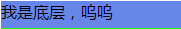
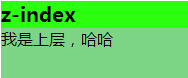

title: z-index和zoom这哥俩         
date: 2015-06-12
tags: [CSS]
categories: [CSS]
toc: true
---

今天为什么要谈这个呢？出于一个页面仔的“窥探”欲吧，也可能不是，因为这些本来就是需要知道的，只是可能没有引起太多人注意。

当然，每个“是什么”的背后都有一个“为什么”，很多人都遇到过“设置了z-index却无用“的问题。

z-index是干嘛的呢？——设置元素在z轴方向的层级。那么怎么用它才是正确滴捏？

先来看正常情况下

    

      <h2>z-index</h2>
      
我是上层，哈哈

      
我是底层，呜呜

    

    css

    .mod{
    background: #BEFFFC;
    /*position: relative;
    z-index: 0;*/
    }
    up,.down{
        height: 50px;
        left: 0;
        }
    .up{
        /*position: relative;*/
        top: 0;
        background: rgb(123,213,132);
        /*z-index: 0;*/
      }
    .down{
        /*position: relative;*/
        top: 0;
        background: rgb(102,134,232);
    /*    z-index: 0;
    */  }

如图

1、我们把z-index的注释去掉

纹丝不动

2、把up和down的定位加上

依然纹丝不动，好吧是的，这个时候不动是正常的，它就不该动。

3、为了能看出差别，父容器定位加上，子元素绝对定位

如图

第一种情况出现了，视野之中，只剩下down，到这里为止，似乎也没跟我们要说的扯上什么关系，但其实是有关系的，我们给它们设置了z-index:0;那么它们现在就是在同样的层级，当是同样层级时，后面会覆盖前面。

再来看

4、去掉定位，使用margin负值把down拉上去

设置z-index，up为2，down为1，纹丝不动

改为定位

旧景重现，but这个时候up在down上面。这是第二个注意点，需要使用定位，才能让z-index起作用！

那么，哪种定位呢？我们来试试一个相对一个绝对，为了看得方便，给down设置绝对，并设置top值。层级仍然不变

如图

如我们所愿，改一下试试，up为1，down为2

如图

哇偶，没问题

5、那如果想跟父元素调调呢？

如元素设为2，子元素设为1

如图

啊？！我真的没骗你，代码已经改了，可是为什么是这样，好吧难道是值不够大？那再改改，父元素改成10，还是不动，100，还是不动，使大招，999！！偶，还是不行，要吐血了。我们总是想使用暴力手段来尝试一些错误的东西，实际上是在跟自己过不去~这是为什么呢？

因为，只要你的子元素使用了大于等于0的值，那么它就永远在父元素上面，不管父元素设置了多么大的z-index值，不信？那么是不是我们给z-index设置为0，子元素设置-1就可以了？

看图

看来没有想的那么简单

去掉父元素的z-index试试

哇，它们消失了，那么这个时候父元素的z-index值是多少呢？借助浏览器来看一下

好的，看来父元素跟子元素不玩儿这个，它们不互相攀比~

6、还有一点，子元素的子元素会是个什么情况呢？

我们索性来直接给它们里面直接套一层div，然后再看会是啥情况

尝试设置up为2，down为1，up子元素为1，down子元素为2

好吧，我们又和哈哈见面了，可以看出，子元素设置了什么不重要，只要父元素设置了更低的z-index值，则子元素是无能为力的。

然而这就这样结束了么？别忘了我们刚才没有给mod设置z-index值的时候，up和down是什么表现？

是的，那么尝试不给down设置值，而只给它的子元素设置z-index，为了看得更清楚，给down定位到偏下位置。

如下，设置为1

老朋友又见面了。。。

设置为2

哇哈哈，down的子元素就酱紫完成了对父元素和up的超越，为什么同时超越了up？别忘了，down是在up之后。

那如果把父元素的z-index清掉，只比较子元素呢，是的，它们同样遵循着”同级后在上，谁高谁在上“的原则。

好了，说了这么多，来个小结：

1、z-index起作用的前提是定位，这一点很重要，很多人设置z-index不起作用就是因为这个，更容易忘的是父子层叠的时候。

2、层级值的比较，只在同级元素或者同级元素的子元素之间，父子之间不会有这样的比较。

3、只要是子元素有着大于等于0的z-index值，那么它就在父元素之上，想在父元素之下，就设置为小于0的值，并且父元素z-index值为auto；

除此之外，还有一点需要注意，z-index的值不会继承，还有人说z-index的默认值是0，刚才大家看到的，不够严谨。

z-index就说到这儿。

其他可参考 z-index

下面简单说说zoom

zoom这个东西大家经常看到使用，而且是对IE浏览器使用。其实是用来缩放的。

很多文章说它是IE专有属性，其实未必。在火狐和chrome下，它依然会起作用，其他的我没测，不好发表看法。

这里是来自caniuse的兼容表

另外两点表现比较诡异，

1、缩放了高度，宽度未变

2、缩放只是看起来，而并未对元素进行真正的缩放

上述两点也是它跟transform：scale表现的区别所在。

可以对它设置数值，如1，也可以设置百分比，如200%。

那它可以用来干嘛

触发ie的hasLayout属性，清除浮动、清除margin的重叠。

有人说css3中它就会没了，显然不是，它还新增了一些东西，比如：

zoom-in/zoom-out

不要误会，它们是属性值，而不是属性，它俩是用来干嘛的呢？

是改变鼠标的形状的，比如这样

enter image description here

具体可以看下张鑫旭的例子CSS3 cursor属性值zoom-in/zoom-out

好了，由于时间紧迫，这篇文要结尾了。不知是否能够对你有所帮助，可能有所疏漏，下次有时间再来祥谈。

欢迎关注微信公众号: 前端周末

欢迎来这里交流：152128548